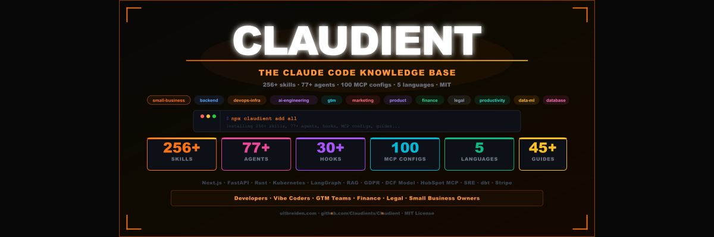

# Claude Code Skills, Agents & Plugins — Claudient

**Claudient** es la base de conocimiento de código abierto más grande para **Claude Code** — la CLI de IA de Anthropic para codificación. Incluye 400+ habilidades de dominio, 182+ agentes especialistas, 42 pilas de espacios de trabajo preconfigurados, 41 configs de MCP, 100+ comandos de barra inclinada, hooks y flujos de trabajo, todos instalables en 30 segundos. Sin necesidad de re-explicar la pila. Claude ya conoce tu dominio.

**¿Nuevo en Claude Code?** Claude Code es el asistente de línea de comandos oficial de Anthropic para desarrollo de software — lee tu base de código, ejecuta comandos, edita archivos y completa tareas autónomamente dentro de tu terminal o IDE. Claudient es la biblioteca comunitaria de código abierto que lo extiende con habilidades de nivel experto en todos los stacks y dominios.

[](https://www.npmjs.com/package/claudient)
[](https://www.npmjs.com/package/claudient)
[](https://github.com/Claudient/Claudient)
[](LICENSE-CODE)
[](LICENSE-CONTENT)
[](#skills-by-category)
[](#agents)
[](#slash-commands)
[](#install-as-a-claude-code-plugin)
[](#claude-for-small-business)
[](#top-100-mcp-servers)
[](#translations)
[](https://www.reddit.com/r/uitbreiden/)
[](https://www.youtube.com/@UITBREIDEN)

**[FR](README.fr.md) · [DE](README.de.md) · [ES](README.es.md) · [NL](README.nl.md)**



**Deja de explicar tu stack a Claude en cada sesión.**

Claudient es la base de conocimiento de código abierto más grande para **Claude Code** — 400+ habilidades, 182+ agentes especialistas, 100+ comandos de barra inclinada, 100+ guías, 40 hooks, 45 flujos de trabajo, 83 estructuras de proyecto, 42 pilas de espacios de trabajo, 10 personas, 32 reglas, 41 configs de servidor MCP, 10 rutinas de automatización, 20 ejemplos anotados de CLAUDE.md, adaptadores entre harnesses (Cursor/Windsurf/Codex/Gemini/Copilot), además de estilos de salida, temas, líneas de estado, enlaces de teclado, plantillas de configuración y un paquete SDK de Agentes — todo instalable en 30 segundos.

```bash
# Instalar como marketplace de plugins de Claude Code (recomendado)
/plugin marketplace add Claudient/Claudient
/plugin install claudient-everything@claudient

# O vía npm
npx claudient add all
```


---

## Instalar como plugin de Claude Code

Claudient se distribuye como un **marketplace de plugins** nativo de Claude Code. Agrega una vez, luego instala solo los dominios que necesitas — las habilidades se invocan automáticamente según en qué estés trabajando, los agentes y hooks vienen incluidos.

```bash
# 1. Agregar el marketplace
/plugin marketplace add Claudient/Claudient

# 2. Instalar un plugin de dominio (o el paquete de todo)
/plugin install claudient-gtm@claudient
/plugin install claudient-devops-infra@claudient
/plugin install claudient-everything@claudient
```

**19 plugins, 400+ habilidades que se invocan automáticamente, 182 agentes, 100 comandos de barra inclinada:**

| Plugin | Habilidades | Plugin | Habilidades |
|---|---|---|---|
| `claudient-productivity` | 66 | `claudient-finance` | 16 |
| `claudient-small-business` | 47 | `claudient-data-ml` | 15 |
| `claudient-backend` | 41 | `claudient-product` | 15 |
| `claudient-devops-infra` | 36 | `claudient-automation` | 14 |
| `claudient-gtm` | 32 | `claudient-database` | 12 |
| `claudient-marketing` | 22 | `claudient-git` | 3 |
| `claudient-legal` | 21 | `claudient-commands` | 100 comandos |
| `claudient-sdr` | 22 | `claudient-personas` | 10 personas |
| `claudient-ai-engineering` | 17 | `claudient-finance-payments` | 2 |
| `claudient-everything` | meta-bundle | | |

Cada habilidad se valida con `claude plugin validate --strict`. ¿Prefieres npm? `npx claudient add all` sigue funcionando.

---

## Más allá de las habilidades — el toolkit completo de Claude Code

Claudient cubre todas las primitivas que Claude Code soporta, no solo habilidades:

| Categoría | Qué incluye | Instalar |
|---|---|---|
| **Comandos de barra inclinada** | 100+ comandos en 12 categorías — git, testing, refactor, docs, debug, devops, database, security, frontend, api, ai-engineering, productivity | Plugin `claudient-commands` o directorio `commands/` |
| **Personas** | 10 perfiles operativos — startup-cto, solo-founder, growth-marketer, indie-hacker, enterprise-architect, data-driven-pm, devrel-advocate, agency-operator, ai-product-builder, fractional-exec | Plugin `claudient-personas` o directorio `personas/` |
| **Estilos de salida** | 8 estilos — concise, mentor, code-reviewer, architect, plain-operator, security-paranoid, diagram-first, tdd-enforcer | copiar a `~/.claude/output-styles/` |
| **Temas** | 10 temas — Dracula, Nord, Tokyo Night, Catppuccin, Gruvbox, Solarized, Monokai, Rosé Pine, + marca Claudient | copiar a `~/.claude/themes/`, luego `/theme` |
| **Líneas de estado** | 6 scripts — minimal, full, cost-watch, context-budget, git-focused, rate-limit | apuntar `settings.json` `statusLine` a ellos |
| **Enlaces de teclado** | 4 presets — vim, emacs, ergonomic, power-user | fusionar en `~/.claude/keybindings.json` |
| **Plantillas de configuración** | 5 iniciadores — solo-dev, team, security-hardened, enterprise, minimal | soltar en `.claude/settings.json` |
| **Hooks** | 40 en todos los eventos de 2026 — incluyendo nuevos tipos de hooks `http`, `prompt` y `agent` | ver [`hooks/`](hooks/) |
| **Rutinas** | 10 plantillas de agentes en la nube programadas — daily-standup, pr-triage, dependency-audit, incident-watch, weekly-retro, sprint-planning, code-review-rotation, security-scan, changelog-generator, cost-audit | ver [`routines/`](routines/) |
| **Habilidades de computer-use** | 4 — ui-testing, visual-qa, legacy-app-automation, screenshot-verify | `/plugin install` o copiar |
| **Galería CLAUDE.md** | 20 plantillas anotadas del mundo real — Next.js SaaS, FastAPI, monorepo, CLI tool, dbt, mobile, OSS library, k8s, small business, legal, fintech, game dev, embedded, y más | ver [`claude-md-examples/`](claude-md-examples/) |
| **Adaptadores entre harnesses** | Usa Claudient en Cursor, Windsurf, Codex CLI, Gemini Code Assist, GitHub Copilot — guías de adaptador + script de instalación | ver [`compatibility/`](compatibility/) |
| **Paquete SDK de agentes** | Guía completa + agentes de inicio ejecutables en Python y TypeScript | ver [`examples/agent-sdk/`](examples/agent-sdk/) |

---

## Comandos de barra inclinada

<a name="slash-commands"></a>

100+ comandos de barra inclinada en 12 categorías — invocar con `/command-name` en cualquier sesión de Claude Code:

| Categoría | Comandos |
|---|---|
| `git` | commit-msg, pr-description, changelog, rebase-helper, conflict-resolver, branch-cleanup, squash-guide, gitignore-gen, release-notes, blame-explain |
| `testing` | write-tests, test-coverage, fix-failing-test, mock-gen, e2e-scaffold, test-plan, flaky-finder, assertion-improve, tdd-start, snapshot-review |
| `refactor` | extract-function, simplify, remove-dead-code, split-file, dedupe, modernize-syntax, tighten-types, rename-symbol, reduce-complexity, inline |
| `docs` | readme-gen, api-docs, docstring-add, architecture-doc, comment-explain, contributing-gen, adr-write, onboarding-doc |
| `debug` | explain-error, add-logging, repro-steps, stacktrace-analyze, memory-leak, race-condition, bisect-helper, perf-profile |
| `devops` | dockerfile-gen, compose-gen, k8s-manifest, ci-pipeline, terraform-module, helm-chart, github-action, env-audit, healthcheck, rollback-plan |
| `database` | migration-gen, query-optimize, schema-review, index-advisor, seed-data, n-plus-one-finder, backup-plan, er-diagram |
| `security` | security-scan, dep-audit, secret-scan, authz-review, input-validation, owasp-check, threat-model, cors-config |
| `frontend` | component-gen, a11y-audit, responsive-fix, state-refactor, form-validation, lighthouse-pass, storybook-gen, css-cleanup |
| `api` | endpoint-gen, openapi-spec, rate-limit, pagination, error-schema, webhook-handler, versioning-plan, sdk-gen |
| `ai-engineering` | prompt-improve, eval-harness, rag-setup, token-optimize, mcp-server-gen, agent-scaffold |
| `productivity` | standup-notes, meeting-summary, task-breakdown, decision-doc, weekly-review, email-draft |

Instalar: `/plugin install claudient-commands@claudient` o copiar [`commands/`](commands/) en `.claude/commands/`.

---

## ¿Por Qué Usar Habilidades de Claude Code?

| Problema | Sin Claudient | Con Claudient |
|---|---|---|
| **Contexto de dominio** | Re-explicar tu stack en cada sesión | Las habilidades se activan automáticamente |
| **Tareas especialistas** | Claude adivina mejores prácticas | 182+ agentes expertos con herramientas de alcance limitado |
| **Integraciones de herramientas** | Copiar-pegar manual entre herramientas | 41 configs de servidor MCP listos para instalar |
| **Automatización de eventos** | Activadores manuales, pasos olvidados | 40 hooks que se disparan en los eventos correctos |
| **Equipo / idioma** | Solo inglés, configuración única | 5 idiomas, componibles por proyecto |
| **Pequeño negocio** | Consejo genérico de IA | 30+ habilidades verticales para flujos de trabajo reales |

**Un comando le da a Claude experiencia instantánea en todos los dominios en los que trabajas.**

---

## ¿Para Quién Es Esto?

| Eres... | Obtienes... |
|---|---|
| **Desarrollador / programador por vibes** | Habilidades para Next.js, FastAPI, Rust, Go, Drizzle, tRPC, Docker, k8s, Terraform, Unity, Flutter, Solidity, y 200+ más stacks — activar con un comando de barra inclinada |
| **Desarrollador móvil** | React Native/Expo, Flutter, SwiftUI, Jetpack Compose, notificaciones push, offline-first, implementación en app store |
| **Desarrollador de juegos** | Unity C#, Unreal C++, Godot GDScript, red de juegos, física, diseño de niveles, perfilado de rendimiento |
| **Ingeniero embebido/IoT** | Arquitectura de firmware, RTOS, BLE, integración de sensores, diseño de bajo consumo, actualizaciones OTA |
| **Constructor Web3** | Auditoría de contratos inteligentes, protocolos DeFi, mercados NFT, gobernanza DAO, optimización de gas |
| **Constructor de productos de IA** | Arquitecto RAG, LangGraph, Ingeniería de Prompts, Evaluación de LLM, Constructor de Servidores MCP, Patrones de API de Claude con almacenamiento en caché de prompts |
| **Ingeniero de GTM / RevOps** | MCP de HubSpot, Agente SDR, Enriquecimiento de Leads, Higiene de CRM, Automatización de Email, Deal Desk |
| **Profesional de finanzas / legal** | Modelos DCF, modelos de 3 estados, memos IC, revisión de contratos, GDPR, SOC 2, Ley de IA de la UE — con puertas obligatorias de revisión humana |
| **Propietario de pequeño negocio** | Habilidades en inglés simple para facturación, flujo de caja, Shopify, reseñas, POPs — sin necesidad de terminal |
| **Equipo DevOps / Plataforma** | Diseño de SLO, ingeniería del caos, Helm, Kubernetes, Terraform, runbooks de SRE, seguimiento de costos |

---

## Preguntas Frecuentes del Desarrollador de Claude Code

### ¿Qué es Claude Code?
Claude Code es el asistente de línea de comandos oficial de Anthropic para desarrollo de software. Se ejecuta en tu terminal o IDE (VS Code, JetBrains), lee tu base de código, edita archivos, ejecuta comandos y completa tareas autónomamente. Instálalo con `npm install -g @anthropic-ai/claude-code` o a través de la aplicación de escritorio.

### ¿Qué son las habilidades de Claude Code?
Las habilidades son archivos markdown en `.claude/commands/` (o cargados a través del sistema de plugins) que definen comportamientos expertos reutilizables. Cuando se activan por un comando de barra inclinada o palabras clave, Claude Code lee la habilidad y aplica su experiencia de dominio al contexto actual — sin necesidad de solicitudes repetidas.

### ¿Cómo es Claudient diferente de escribir un archivo CLAUDE.md?
Un `CLAUDE.md` establece contexto a nivel de proyecto para un repositorio. Las habilidades de Claudient son a nivel de dominio y reutilizables en todos los proyectos — 400+ habilidades que cubren FastAPI, Kubernetes, HubSpot, React, Terraform y cientos más stacks.

### ¿Funciona Claudient con Cursor, GitHub Copilot u otras herramientas de codificación con IA?
Claudient está diseñado para Claude Code (CLI y extensiones de IDE). Los adaptadores entre harnesses en [`compatibility/`](compatibility/) también soportan Cursor, Windsurf, Codex CLI, Gemini Code Assist y GitHub Copilot.

### ¿Cómo instalo habilidades de Claude Code desde Claudient?
Ejecuta `npx claudient add all` para instalar todo, o usa el sistema de plugins de Claude Code: `/plugin marketplace add Claudient/Claudient` luego `/plugin install claudient-everything@claudient`. Instala por dominio con `npx claudient add skills backend` o `npx claudient add skills devops-infra`.

---

## Paquetes de Profesiones — 25 Configuraciones de Claude Code Específicas del Rol

25 paquetes específicos de profesión — pilas de habilidades preconfiguradas, agentes, flujos de trabajo y rutinas diarias para cada rol.

| Profesión | Instalar | Guía |
|---|---|---|
| SDR / Representante de Ventas | `npx claudient add skill gtm/sdr-research-brief` | [Guía](guides/for-sdr.md) |
| Fundador / CEO | `npx claudient add skill gtm/founder-operating-system` | [Guía](guides/for-founder.md) |
| Gerente de Producto | `npx claudient add skill product/product-discovery` | [Guía](guides/for-product-manager.md) |
| Ingeniero DevOps / Plataforma | `npx claudient add skill devops-infra/kubernetes-architect` | [Guía](guides/for-devops-engineer.md) |
| Marketero de Contenido / SEO | `npx claudient add skill marketing/seo-audit` | [Guía](guides/for-content-marketer.md) |
| Analista Financiero / CFO | `npx claudient add skill finance/dcf-model` | [Guía](guides/for-finance-analyst.md) |
| Legal / Oficial de Cumplimiento | `npx claudient add skill legal/contract-review` | [Guía](guides/for-legal-compliance.md) |
| Hacker de Crecimiento / Marketero de Rendimiento | `npx claudient add skill marketing/paid-ads` | [Guía](guides/for-growth-marketer.md) |
| Gerente de Éxito del Cliente | `npx claudient add skill gtm/customer-success` | [Guía](guides/for-customer-success.md) |
| Reclutador / RRHH | `npx claudient add skill small-business/hiring-pipeline` | [Guía](guides/for-recruiter.md) |
| Diseñador / Investigador UX | `npx claudient add skill product/ux-research` | [Guía](guides/for-ux-designer.md) |
| Escritor Técnico | `npx claudient add skill productivity/adr-writer` | [Guía](guides/for-technical-writer.md) |
| Ejecutivo de Cuenta | `npx claudient add skill gtm/deal-desk` | [Guía](guides/for-account-executive.md) |
| Gerente de Operaciones / COO | `npx claudient add skill small-business/sop-writer` | [Guía](guides/for-operations-manager.md) |
| Marketero de Email | `npx claudient add skill gtm/email-automation` | [Guía](guides/for-email-marketer.md) |
| Operador de E-commerce | `npx claudient add skill small-business/ecommerce-seller` | [Guía](guides/for-ecommerce-operator.md) |
| CTO / Tech Lead | `npx claudient add skill productivity/tech-debt-tracker` | [Guía](guides/for-cto.md) |
| Agente Inmobiliario | `npx claudient add skill small-business/real-estate-listing` | [Guía](guides/for-real-estate-agent.md) |
| Inversor / Analista de VC | `npx claudient add skill finance/ic-memo` | [Guía](guides/for-investor.md) |
| Analista de Datos / Analista BI | `npx claudient add skill data-ml/dbt` | [Guía](guides/for-data-analyst.md) |
| Freelancer / Consultor | `npx claudient add skill small-business/freelancer-proposal` | [Guía](guides/for-freelancer.md) |
| Asistente Ejecutivo / Jefe de Gabinete | `npx claudient add skill productivity/meeting-to-action` | [Guía](guides/for-executive-assistant.md) |
| Educador / Creador de Cursos | `npx claudient add skill small-business/online-course-creator` | [Guía](guides/for-educator.md) |
| Ingeniero de Software | `npx claudient add skills backend` | usa habilidades existentes — sin guía dedicada aún |
| Administrador de Salud | `npx claudient add skills small-business` | usa habilidades existentes — sin guía dedicada aún |

Cada paquete incluye: comandos de barra inclinada específicos del dominio, un conjunto de agentes curado, un flujo de trabajo diario, un plan de rampa de 30 días y configs de integración de herramientas.

---

## Pilas de Espacios de Trabajo — 42 Espacios de Trabajo de Dominio Preconfigurados

Pilas completas de espacios de trabajo con un `CLAUDE.md`, 8 habilidades y estructura de proyecto — cada una diseñada para un rol o dominio específico. Suelta una pila en tu proyecto y Claude tendrá instantáneamente experiencia de dominio.

### Ingeniería e Infraestructura

| Pila | Dominio | Habilidades |
|---|---|---|
| `fullstack_developer_stack` | Desarrollo web full-stack | 8 |
| `frontend_engineer_stack` | React, Vue, Angular, Svelte | 8 |
| `api_developer_stack` | Diseño de API, OpenAPI, auth, webhooks | 8 |
| `devops_platform_stack` | Kubernetes, Terraform, CI/CD, IaC | 8 |
| `sre_stack` | SLOs, presupuestos de error, respuesta a incidentes | 8 |
| `security_engineer_stack` | Pruebas de penetración, cumplimiento, modelado de amenazas | 8 |
| `database_admin_stack` | Optimización de consultas, migraciones, copias de seguridad | 8 |
| `mobile_developer_stack` | React Native, Flutter, SwiftUI, Compose | 8 |
| `game_developer_stack` | Unity, Unreal, Godot, red, física | 8 |
| `embedded_iot_stack` | Firmware, RTOS, BLE, actualizaciones OTA | 8 |
| `blockchain_web3_stack` | Contratos inteligentes, DeFi, NFTs, DAOs | 8 |

### Datos e IA

| Pila | Dominio | Habilidades |
|---|---|---|
| `data_engineer_stack` | dbt, Spark, Airflow, tuberías de datos | 8 |
| `mlai_engineer_stack` | Modelos ML, entrenamiento, implementación, MLOps | 8 |
| `analytics_engineer_stack` | BI, dashboards, métricas, experimentación | 8 |

### Negocio y GTM

| Pila | Dominio | Habilidades |
|---|---|---|
| `founder_ceo_stack` | Estrategia, recaudación de fondos, construcción de equipo | 8 |
| `finance_cfo_stack` | Modelado financiero, economía unitaria, informes | 8 |
| `gtm_engineer_stack` | HubSpot, CRM, revenue ops, análisis | 8 |
| `content_marketing_stack` | SEO, estrategia de contenido, copywriting | 8 |
| `customer_success_stack` | Retención, NRR, onboarding, health scores | 8 |
| `sales_operations_stack` | Pipeline, previsión, deal desk | 8 |
| `product_manager_stack` | Descubrimiento, roadmaps, experimentos | 8 |
| `growth_engineer_stack` | Experimentación, pruebas A/B, bucles de crecimiento | 8 |
| `brand_manager_stack` | Estrategia de marca, posicionamiento, directrices | 8 |

### Operaciones y Soporte

| Pila | Dominio | Habilidades |
|---|---|---|
| `operations_manager_stack` | Optimización de procesos, POPs, gestión de proveedores | 8 |
| `user_research_stack` | Diseño de estudio, entrevistas, síntesis | 8 |
| `hr_people_operations_stack` | Flujos de trabajo de RRHH, análisis de personas | 8 |
| `qa_testing_engineer_stack` | Estrategia de prueba, automatización, calidad | 8 |
| `technical_writer_stack` | Documentación, docs de API, guías de estilo | 8 |
| `legal_operations_stack` | Gestión de contratos, cumplimiento | 8 |
| `podcast_producer_stack` | Producción de episodios, distribución | 8 |
| `newsletter_writer_stack` | Escritura de boletín, crecimiento | 8 |
| `youtube_creator_stack` | Producción de video, SEO, crecimiento | 8 |
| `investor_vc_stack` | Flujo de trato, due diligence, cartera | 8 |
| `recruiter_ta_stack` | Sourcing, screening, onboarding | 8 |
| `ecommerce_operator_stack` | Shopify, marketplace, inventario | 8 |
| `b2b_consultant_stack` | Gestión de cliente, propuestas | 8 |
| `ai_sdr_stack` | Flujos de trabajo de SDR potenciados con IA | 8 |
| `community_manager_stack` | Engagement comunitario, moderación | 8 |
| `bio_research_stack` | Diseño experimental, bioestadística, publicación | 8 |
| `healthcare_stack` | Ops clínicas, HIPAA, integración EHR, telesalud | 8 |

```bash
# Instalar una pila completa de espacio de trabajo
npx claudient add all   # incluye las 42 pilas
```

---

## Inicio Rápido — Instalar Habilidades de Claude Code en 30 Segundos

```bash
# Instalar todo
npx claudient add all

# Instalar por dominio
npx claudient add skills backend          # 40+ habilidades de backend
npx claudient add skills devops-infra     # Kubernetes, Terraform, Docker, CI/CD
npx claudient add skills ai-engineering   # RAG, LangGraph, Claude API, constructor MCP
npx claudient add skills legal            # GDPR, SOC 2, contratos, revisión NDA
npx claudient add skills finance          # DCF, modelo de 3 estados, pitch deck
npx claudient add skills small-business   # Perseguidor de facturas, flujo de caja, Shopify

# Instalar agentes
npx claudient add agents                  # Todos los 182+ agentes especialistas

# Instalar en tu idioma
npx claudient add all --lang fr           # Francés
npx claudient add all --lang de           # Alemán
npx claudient add all --lang nl           # Holandés
npx claudient add all --lang es           # Español

# Descubrir
npx claudient search "circuit breaker"
npx claudient list
```

---

## Estructura del Repositorio

```
Claudient/
├── .claude-plugin/           # Manifiestos de plugin y marketplace
│   ├── plugin.json           # Metadatos de plugin y rutas de componentes
│   └── marketplace.json      # Catálogo del marketplace para /plugin marketplace add
│
├── plugins/                  # 19 plugins de dominio instalables
│   ├── claudient-productivity/     # 66 habilidades
│   ├── claudient-small-business/   # 47 habilidades
│   ├── claudient-backend/          # 41 habilidades
│   ├── claudient-devops-infra/     # 36 habilidades
│   ├── claudient-gtm/              # 32 habilidades
│   ├── claudient-marketing/        # 22 habilidades
│   ├── claudient-legal/            # 21 habilidades
│   ├── claudient-sdr/              # 18 habilidades
│   ├── claudient-ai-engineering/   # 17 habilidades
│   ├── claudient-finance/          # 16 habilidades
│   ├── claudient-data-ml/          # 15 habilidades
│   ├── claudient-product/          # 15 habilidades
│   ├── claudient-automation/       # 14 habilidades
│   ├── claudient-database/         # 12 habilidades
│   ├── claudient-git/              # 3 habilidades
│   ├── claudient-commands/         # 100 comandos de barra inclinada
│   ├── claudient-personas/         # 10 personas
│   └── claudient-everything/       # meta-bundle (todos los dominios)
│
├── skills/                   # 400+ habilidades de dominio que se invocan automáticamente
│   ├── backend/              # Next.js, FastAPI, Go, Rust, .NET, Rails, Laravel, Flutter
│   ├── devops-infra/         # Kubernetes, Terraform, Docker, CI/CD, AWS/GCP/Azure, Helm
│   ├── ai-engineering/       # Claude API, RAG, LangGraph, constructor MCP, Agent Teams, Ultraplan
│   ├── data-ml/              # dbt, Spark, Kafka, MLOps, PyTorch, Pandas/Polars
│   ├── database/             # Drizzle, Prisma, PostgreSQL, Supabase, Redis, Elasticsearch
│   ├── gtm/                  # HubSpot, SDR, automatización de email, higiene de CRM, deal desk
│   ├── legal/                # Revisión de contratos, GDPR, SOC 2, Ley de IA de la UE, NDA, liberación de IP
│   ├── finance/              # DCF, modelo de 3 estados, memo IC, pitch deck, reconciliador GL
│   ├── marketing/            # SEO, SEO de IA, anuncios pagados, estrategia de contenido, CRO, copywriting
│   ├── product/              # Descubrimiento, roadmap, investigación UX, teardown competitivo
│   ├── productivity/         # Revisión de PR, escritor ADR, rastreador de deuda técnica, TDD guard
│   ├── small-business/       # Perseguidor de facturas, QuickBooks, Shopify, 14 verticales de industria
│   ├── automation/           # Playwright, automatización de navegador, Remotion, andamio SaaS
│   ├── computer-use/         | Pruebas de UI, QA visual, automatización de aplicaciones heredadas, screenshot verify
│   ├── git/                  # Automatización de flujo de trabajo Git
│   ├── sdr/                  # Habilidades de representante de desarrollo de ventas
│   └── finance-payments/     # Habilidades de pagos y fintech
│
├── agents/                   # 182+ subagentes especialistas
│   ├── advisors/             # 15 agentes de nivel C (CEO, CTO, CFO, CMO, CISO, COO, CPO...)
│   ├── core/                 # architect · planner · code-reviewer · security-reviewer
│   ├── roles/                # 100+ especialistas de dominio (SRE, k8s, RAG, fintech, legal...)
│   ├── specialists/          # small-business-advisor, ecommerce, local-services
│   ├── build-resolvers/      # Resolvedores de errores de compilación de TypeScript y Python
│   └── sdr/                  # Agentes SDR y GTM
│
├── commands/                 # 100+ comandos de barra inclinada en 12 categorías
│   ├── git/                  # commit-msg · pr-description · changelog · release-notes
│   ├── testing/              # write-tests · test-coverage · fix-failing-test · e2e-scaffold
│   ├── refactor/             # extract-function · simplify · remove-dead-code · modernize-syntax
│   ├── docs/                 # readme-gen · api-docs · docstring-add · architecture-doc
│   ├── debug/                # explain-error · stacktrace-analyze · memory-leak · perf-profile
│   ├── devops/               # dockerfile-gen · k8s-manifest · ci-pipeline · terraform-module
│   ├── database/             # migration-gen · query-optimize · index-advisor · er-diagram
│   ├── security/             # security-scan · dep-audit · secret-scan · threat-model
│   ├── frontend/             # component-gen · a11y-audit · storybook-gen · css-cleanup
│   ├── api/                  # endpoint-gen · openapi-spec · rate-limit · webhook-handler
│   ├── ai-engineering/       # prompt-improve · rag-setup · mcp-server-gen · agent-scaffold
│   └── productivity/         # standup-notes · task-breakdown · decision-doc · weekly-review
│
├── hooks/                    # 40 automatizaciones impulsadas por eventos
│   ├── pre-tool-use/         # secret-scanner · injection-scanner · block-dangerous · git-push-confirm
│   ├── post-tool-use/        # tdd-guard · lint-check · test-runner · auto-git-stage
│   ├── lifecycle/            # session-context-loader · keepalive-poke
│   ├── notification/         # telegram-pr-notify · ntfy-push · tts-announcer
│   ├── permission/           # auto-allow-readonly
│   ├── subagent/             # agent-comms
│   ├── context/              # context injection hooks
│   └── advanced/             # sound-system · audit-log · output-size-warn
│
├── guides/                   # 100+ archivos de documentación legibles para humanos
│   └── [de/ · es/ · fr/ · nl/]    # Versiones traducidas
├── workflows/                # 45+ flujos de trabajo de proceso de extremo a extremo
│   └── [de/ · es/ · fr/ · nl/]
├── prompts/                  # 31+ plantillas de prompt reutilizables
│   ├── system-prompts/       # Plantillas de prompts del sistema basadas en roles
│   ├── project-starters/     # Prompts de inicialización de proyectos
│   └── task-specific/        # Plantillas de prompts específicas de tareas
├── rules/                    # 32 archivos de directrices siempre a seguir
│   ├── common/               # Principios de codificación y flujo de trabajo independientes del idioma
│   └── language-specific/    # Reglas de estilo por idioma
├── mcp/                      # 41 guías de configuración de servidor MCP
│   └── configs/              # Configs JSON listos para usar (GitHub, Postgres, Redis, Kafka, Docker, y más)
├── personas/                 # 10 perfiles operativos
├── output-styles/            # 8 definiciones de estilo de salida
├── themes/                   # 10 temas de UI (Dracula, Nord, Tokyo Night, Catppuccin...)
├── statuslines/              # 6 scripts de línea de estado
├── keybindings/              # 4 presets: vim · emacs · ergonomic · power-user
├── settings-templates/       # 5 plantillas settings.json de inicio
├── routines/                 # 10 plantillas de rutina de agente en la nube programada
├── compatibility/            # Adaptadores entre harnesses (Cursor, Windsurf, Codex, Gemini, Copilot)
├── claude-md-examples/       # 20 plantillas CLAUDE.md anotadas del mundo real
├── examples/                 # Referencias completas de proyectos funcionales
│   ├── agent-sdk/            # Iniciadores del SDK de Agente en Python y TypeScript
│   ├── nextjs-saas/          # Next.js + Supabase + Stripe
│   ├── fastapi-ai-app/       # FastAPI + Claude API
│   ├── go-cli-tool/          # Herramienta CLI Go
│   └── dbt-pipeline/         # Tubería de datos dbt
├── structures/               # 83 plantillas de estructura de proyecto
├── professional-stacks/      # 50 pilas de espacios de trabajo preconfiguradas (CLAUDE.md + 8 habilidades cada una)
├── scripts/                  # Scripts de compilación y utilidad
├── docs/                     # ADRs y documentación interna
└── index.json                # Índice completo y buscable (npx claudient search)
```

---

## Habilidades Más Populares de Claude Code Ahora Mismo

| Habilidad / Agente | Qué hace | Categoría |
|---|---|---|
| `/nextjs-app` | Next.js App Router, Componentes de Servidor, Acciones de Servidor, Drizzle | Backend |
| `/fastapi` | FastAPI de Producción con auth, Pydantic, async, tests, Docker | Backend |
| `/sre-engineer` | Diseño de SLO, presupuestos de error, alertas de tasa de quemado, runbooks | Agente |
| `/security-audit` | Escaneo OWASP Top 10, verificación de exposición de secretos antes de cada PR | Agente |
| `/invoice-chaser` | Recordatorios automatizados de AR y escalado de pagos (sin necesidad de código) | Pequeño Negocio |
| `/hubspot` | Automatización de CRM vía el servidor HubSpot MCP oficial | GTM |
| `/rag-architect` | Estrategia de fragmentación, embeddings, recuperación, reranking, eval | Ingeniería de IA |
| `/kubernetes-architect` | Manifiestos de K8s, gráficos de Helm, HPA, NetworkPolicy, RBAC | DevOps |
| `/smart-contract-audit` | Auditoría de seguridad de Solidity — reentrancia, control de acceso, oráculos | Blockchain/Web3 |
| `/unity-csharp` | Unity DOTS/ECS, MonoBehaviour, ScriptableObjects | Game Dev |
| `/firmware-architecture` | HAL, drivers, diseño de memoria para sistemas embebidos | Embebido/IoT |

---

<a name="top-100-mcp-servers"></a>

## Top 100 Servidores MCP para Claude Code — Pila de Inicio del Constructor Indie

> **La forma más rápida de extender Claude Code.** Los servidores MCP le dan a Claude acceso directo a tus herramientas — GitHub, Figma, Stripe, Jira, Notion, Slack, y 94 más.

**La pila de inicio del constructor indie:**

| Servidor | Qué hace | Búsquedas Mensuales |
|--------|-------------|-----------------|
| [Playwright MCP](mcp/playwright-mcp.md) | Automatización de navegador — navegar, hacer clic, captura de pantalla, scraping | 82K |
| [Figma MCP](mcp/figma.md) | Leer diseños, extraer tokens, generar componentes desde especificaciones | 74K |
| [GitHub MCP](mcp/github.md) | Leer PRs, crear problemas, buscar código, gestionar versiones | 69K |
| [Atlassian MCP](mcp/atlassian.md) | Tickets de Jira, docs de Confluence, gestión de sprints | 40K |
| [Memory MCP](mcp/memory.md) | Gráfico de conocimiento persistente en sesiones de Claude Code | — |
| [Stripe MCP](mcp/stripe.md) | Consultar clientes, suscripciones, pagos, datos de churn | — |
| [Notion MCP](mcp/notion.md) | Leer/escribir páginas, consultar bases de datos, crear docs | — |
| [Taskmaster MCP](mcp/taskmaster.md) | Gestión de tareas de IA con aislamiento de contexto en sesiones | — |
| [Postgres MCP](mcp/postgres.md) | Consultas SQL, inspección de esquema, gestión de tablas | — |
| [Redis MCP](mcp/redis.md) | Inspección de caché, gestión de claves, estadísticas de memoria | — |
| [Jira MCP](mcp/jira.md) | Gestión de problemas, seguimiento de sprints, consultas JQL | — |
| [Docker MCP](mcp/docker.md) | Inspección de contenedor, análisis de registros, monitoreo de recursos | — |

**→ [Guía completa: Top 100 Servidores MCP para Constructores Indie](mcp/top-mcp-servers.md)** — configs de instalación, rankings de nivel y paquetes curados para cada stack.

```bash
npx claudient add mcp starter   # GitHub + Memory + Playwright
npx claudient add mcp all       # Todas las 40 guías de configuración individuales
```

---

<a name="claude-for-small-business"></a>

## Claude para Pequeños Negocios — 30+ Habilidades Verticales

> **La base de conocimiento comunitaria más completa para usar Claude en un pequeño negocio.** Habilidades en inglés simple, sin necesidad de terminal, escritas para propietarios que ya pagan por QuickBooks, Shopify, HubSpot y el resto. Claudient extiende el lanzamiento oficial de Anthropic [Claude for Small Business](guides/claude-for-small-business.md) con 30+ habilidades que cubren la larga cola de verticales y flujos de trabajo.

```bash
npx claudient add skills small-business
```

### Claude para Pequeños Negocios por Vertical

Cada guía es una página de destino de extremo a extremo para una industria específica — configuración, pila de habilidades, expectativas de 30/60/90, PF.

| Eres un... | Comienza aquí |
|---|---|
| **Autoempleado, fundador en solitario, proyecto paralelo** | [Claude para Autoempleados](guides/claude-for-solopreneurs.md) |
| **Vendedor de Shopify, Amazon, Etsy o DTC** | [Claude para Ecommerce](guides/claude-for-ecommerce.md) |
| **Operador de oficios, salón, dental, fitness, restaurante, bienes raíces** | [Claude para Servicios Locales](guides/claude-for-local-services.md) |
| **Coach ejecutivo, consultor empresarial, asesor fraccionario** | [Claude para Coaches y Consultores](guides/claude-for-coaches-consultants.md) |
| **Escritor de boletín, podcaster, creador de cursos** | [Claude para Creadores](guides/claude-for-creators.md) |
| **Primerizo, quiero la descripción general completa** | [Claude para Pequeños Negocios — Guía de Producto](guides/claude-for-small-business.md) |

### Principales Habilidades de Pequeños Negocios

| Habilidad | Automatiza | Funciona con |
|---|---|---|
| `/invoice-chaser` | Recordatorios de AR, escalado de pagos | QuickBooks, Stripe |
| `/quickbooks-workflow` | Cierre de fin de mes, reconciliación | QuickBooks |
| `/cash-flow-forecast` | Posición de caja a 30 días, runway de nómina | QuickBooks, PayPal |
| `/expense-audit` | Aumento de suscripciones, proveedores duplicados | QuickBooks |
| `/content-repurposer` | 1 resumen → blog + redes sociales + email + anuncios | Canva |
| `/review-response` | Gestión de reseñas de Google/Yelp | Google, Yelp |
| `/customer-inquiry` | Respondedor de PF, respuestas después de horas | Sitio web, CRM |
| `/shopify-operations` | Descripciones de productos, alertas de inventario | Shopify |
| `/sop-writer` | Procedimientos operativos estándar | Cualquier negocio |
| `/weekly-pulse` | Dashboard de KPI de todas tus herramientas | Multi-herramienta |

### Habilidades Específicas del Vertical

| Vertical | Habilidad |
|---|---|
| Ecommerce (multi-plataforma) | [`/ecommerce-seller`](skills/small-business/ecommerce-seller.md) |
| Salón, spa, barbería | [`/salon-spa-ops`](skills/small-business/salon-spa-ops.md) |
| Práctica dental | [`/dental-practice`](skills/small-business/dental-practice.md) |
| Estudio de fitness, gimnasio | [`/fitness-gym-ops`](skills/small-business/fitness-gym-ops.md) |
| Práctica de coaching | [`/coaching-business`](skills/small-business/coaching-business.md) |
| Curso en línea | [`/online-course-creator`](skills/small-business/online-course-creator.md) |
| Boletín | [`/newsletter-publisher`](skills/small-business/newsletter-publisher.md) |
| Agencia de marketing/creativa | [`/agency-operations`](skills/small-business/agency-operations.md) |
| Oficios (plomería, HVAC, eléctrica) | [`/contractor-trades`](skills/small-business/contractor-trades.md) |
| Estudio de fotografía | [`/photography-studio`](skills/small-business/photography-studio.md) |
| Firma de contabilidad | [`/bookkeeper-practice`](skills/small-business/bookkeeper-practice.md) |
| Podcast | [`/podcast-monetizer`](skills/small-business/podcast-monetizer.md) |
| Bienes raíces | [`/real-estate-listing`](skills/small-business/real-estate-listing.md) |
| Restaurante | [`/restaurant-ops`](skills/small-business/restaurant-ops.md) |

### Habilidades del Operador (Transversales)

| Habilidad | Caso de Uso |
|---|---|
| [`/hiring-pipeline`](skills/small-business/hiring-pipeline.md) | Screening estructurado para flujo de solicitudes de alto volumen |
| [`/churn-prevention`](skills/small-business/churn-prevention.md) | Identificación de riesgo y recuperación para negocios de suscripción |
| [`/pricing-optimizer`](skills/small-business/pricing-optimizer.md) | Revisión de precios estructurada, plan de migración, diseño de prueba A/B |
| [`/freelancer-proposal`](skills/small-business/freelancer-proposal.md) | Llamada de descubrimiento → propuesta de marca en 20 minutos |
| [`/lead-triager`](skills/small-business/lead-triager.md) | Puntuación de ICP en nuevos contactos, lista de llamadas priorizada |
| [`/meeting-to-action`](skills/small-business/meeting-to-action.md) | Transcripción → lista de acciones + email de seguimiento |
| [`/customer-feedback-synthesizer`](skills/small-business/customer-feedback-synthesizer.md) | Detección de patrones en 100+ reseñas |
| [`/competitor-monitor`](skills/small-business/competitor-monitor.md) | Qué lanzaron tus 3 competidores más cercanos este mes |
| [`/margin-analyzer`](skills/small-business/margin-analyzer.md) | Margen bruto por producto, canal, cliente |
| [`/tax-organizer`](skills/small-business/tax-organizer.md) | Paquete de CPA desde QuickBooks y carpeta de recibos |

### Agentes Especialistas para Pequeños Negocios

- [`small-business-advisor`](agents/specialists/small-business-advisor.md) — diagnóstico generalista y priorización de flujo de trabajo
- [`ecommerce-specialist`](agents/specialists/ecommerce-specialist.md) — para operadores de Shopify/Amazon/Etsy/DTC
- [`local-services-specialist`](agents/specialists/local-services-specialist.md) — para oficios, salón, dental, fitness, restaurante, bienes raíces
- [`restaurant-specialist`](agents/roles/restaurant-specialist.md) — operaciones específicas del restaurante
- [`real-estate-specialist`](agents/roles/real-estate-specialist.md) — operaciones de agente inmobiliario y corretaje

```bash
npx claudient add agents small-business
```

---

## Preguntas Frecuentes — Claude para Pequeños Negocios

### ¿Qué es Claude para Pequeños Negocios?

Claude para Pequeños Negocios es la capa de producto enfocada en pequeños negocios de Anthropic dentro de Claude Cowork, lanzada el 13 de mayo de 2026, con 15 flujos de trabajo oficiales. Claudient es la base de conocimiento comunitaria que extiende esos flujos de trabajo con 30+ habilidades adicionales que cubren la larga cola de verticales (dental, salón, oficios, fotografía, coaching, ecommerce) y flujos de trabajo del operador (contratación, churn, precios, propuestas). [Lee la guía del producto](guides/claude-for-small-business.md).

### ¿Es Claude bueno para propietarios de pequeños negocios?

Sí. Los propietarios que dirigen negocios de 1-50 personas típicamente ahorran 6-12 horas por semana en 30 días, en el trabajo mecánico que anteriormente llenaba sus noches — facturación, seguimiento de leads, informes semanales, repropósito de contenido, PF del cliente. Las habilidades de Claudient están escritas primero para operadores, sin necesidad de terminal.

### ¿Cómo es Claude diferente de ChatGPT para pequeños negocios?

ChatGPT es un asistente de chat generalista. Claude para Pequeños Negocios se conecta a tus herramientas de negocio reales — QuickBooks, HubSpot, PayPal, Google Workspace, Shopify — y produce resultados arraigados en tus datos reales. ChatGPT puede escribir un recordatorio de factura genérico; Claude lee tu informe de envejecimiento de AR real y redacta recordatorios personalizados por factura. La diferencia se compone en todos los flujos de trabajo.

### ¿Cuánto cuesta Claude para un pequeño negocio?

$20/mes para Claude Pro cubre la mayoría de propietarios en solitario y operaciones pequeñas. $30/asiento/mes para Claude Team si tienes un socio, gerente de oficina o asistente usando los flujos de trabajo. $100/mes para Claude Max si ejecutas 6+ flujos de trabajo diarios en conjuntos de datos grandes. Todo lo demás — QuickBooks, HubSpot, Shopify — ya pagas por ello.

### ¿Necesito saber cómo codificar?

No. Los flujos de trabajo oficiales de Claude para Pequeños Negocios son punto y clic dentro de Claude Cowork. Las habilidades de Claudient en este repositorio se activan escribiendo inglés simple a Claude. El único setup es conectar OAuth tus herramientas existentes, que toma unos pocos clics por herramienta.

### ¿Puede Claude leer mis datos de QuickBooks?

Sí, una vez que autorices la integración de QuickBooks Online a través de OAuth. Claude lee tus facturas, transacciones, clientes e informes en el momento en que se ejecuta un flujo de trabajo. No consulta tu cuenta en segundo plano, y Anthropic no utiliza datos de negocio conectados para entrenar Claude.

### ¿Puede Claude reemplazar mi contador o CPA?

No, y no deberías querer que lo haga. Claude prepara la reconciliación, organiza los recibos y redacta el P&L. Tu contador o CPA revisa y firma. El costo combinado es menor que un contador solo, y el tiempo de respuesta es más rápido.

### ¿Funciona Claude con Shopify?

Sí, vía el MCP oficial de Shopify. La habilidad [Shopify Operations](skills/small-business/shopify-operations.md) y la habilidad [Ecommerce Seller](skills/small-business/ecommerce-seller.md) cubren descripciones de productos, alertas de inventario, títulos SEO, actualizaciones de colecciones y trabajo de listados entre plataformas.

### ¿Funciona Claude con HubSpot?

Sí, vía el MCP oficial de HubSpot. [Lead Triager](skills/small-business/lead-triager.md), [Cold Outreach](skills/small-business/cold-outreach.md) y [Email Campaign](skills/small-business/email-campaign.md) leen y escriben en HubSpot vía la integración.

### ¿Cómo empiezo?

Ejecuta `npx claudient add skills small-business` para instalar todas las habilidades de pequeño negocio en tu entorno de Claude Code. Luego comienza con un flujo de trabajo — [Invoice Chaser](skills/small-business/invoice-chaser.md) es el punto de inicio de ROI más alto para la mayoría de negocios — y revisa cuidadosamente el resultado en la primera ejecución.

### ¿Vale la pena Claude para Pequeños Negocios?

Para negocios donde el propietario gasta 6+ horas por semana en actividades que Claude cubre (facturación, seguimiento de leads, informes, contenido, PF del cliente, operaciones verticales), sí — típicamente un ROI de 3-5x en 60 días. Para negocios que ya ejecutan pilas automatizadas ajustadas, el retorno marginal es menor. Lee la [guía de ROI](guides/small-business-roi.md) para la calculadora y datos de referencia.

### ¿Y si no estoy usando ninguna de estas herramientas?

Las habilidades de Claudient se ejecutan en datos copiados-pegados cuando una integración directa no está disponible. Pierdes algo de la automatización del flujo de trabajo pero mantienes el borrador estructurado, puntuación y análisis. Por ejemplo, [Review Response](skills/small-business/review-response.md) funciona en reseñas de Google que pegas, incluso sin integración de Google.

---

<a name="agents"></a>

## 182+ Agentes Especialistas de Claude Code

Agentes especialistas generados con la herramienta `Agent` en Claude Code. Cada uno tiene un modelo específico, restricciones de herramientas y condiciones de activación para que Claude delegue el trabajo correcto al experto correcto.

### Asesores de Nivel C (15 agentes)

| Agente | Dominio |
|---|---|
| `ceo-advisor` | Estrategia, preparación de junta, relaciones de inversores, diseño organizacional |
| `cto-advisor` | Decisiones arquitectónicas, compilar vs comprar, estrategia técnica |
| `cfo-advisor` | Economía unitaria, recaudación de fondos, gestión de caja, modelado |
| `cmo-advisor` | Estrategia de GTM, asignación de canal, posicionamiento, generación de demanda |
| `ciso-advisor` | Diseño de programa de seguridad, priorización de riesgos, informes a junta |
| `coo-advisor` | Diseño de procesos, OKRs, escalado de operaciones |
| `cpo-advisor` | Roadmap, descubrimiento, precios, estrategia PLG |
| `cro-advisor` | Previsión de ingresos, análisis de NRR, diseño de modelo de ventas |
| `general-counsel` | Riesgo legal, revisión de contratos, descripción general de cumplimiento |
| `chief-of-staff` | Ritmo operativo, facilitación de OKR, apalancamiento del CEO |
| + 5 más | CDO, CAIO, VPE, CHRO, CCO |

### Especialistas de Ingeniería

`sre-engineer` · `chaos-engineer` · `penetration-tester` · `kubernetes-architect` · `security-auditor` · `platform-engineer` · `network-engineer` · `rust-engineer` · `mlops-engineer` · `graphql-architect` · `websocket-engineer` · `fullstack-developer` · `llm-architect` · `codebase-orchestrator` · `multi-agent-coordinator` + 30 más

### Especialistas de Dominio

`competitive-analyst` · `market-researcher` · `trend-analyst` · `quant-analyst` · `fintech-engineer` · `healthcare-admin` · `legal-advisor` · `nlp-engineer` · `data-pipeline-architect` + más

```bash
npx claudient add agents
```

---

<a name="skills-by-category"></a>

## Habilidades por Categoría — 400+ Habilidades de Claude Code

**400+ habilidades · 19 categorías · EN · FR · DE · NL · ES**

| Categoría | Cantidad | Principales habilidades |
|---|---|---|
| `backend/nodejs` | 25 | Next.js, Hono, NestJS, tRPC, Astro, Svelte, React Native, Angular, WebSockets |
| `backend/python` | 5 | FastAPI, Django, pytest, Python Async |
| `backend/other` | 11 | Go, C#/.NET, Spring Boot, Rust, Rails, Laravel, Elixir, Flutter, PHP, Ruby, Swift |
| `devops-infra` | 36 | AWS/Azure/GCP, Kubernetes, Helm, Terraform, Terragrunt, Docker, GitHub Actions, Sentry, OpenTelemetry |
| `ai-engineering` | 20 | Claude API, Vercel AI SDK, LangGraph, RAG Architect, Almacenamiento de Prompts, Batch API, Constructor MCP, Agent Teams, Ultraplan, Ultrareview |
| `data-ml` | 15 | dbt, Spark, Kafka, MLOps, NLP Pipelines, Aprendizaje Reforzado, Pandas/Polars, PyTorch |
| `database` | 12 | Drizzle, Prisma, PostgreSQL, Supabase, Neon, Redis, Elasticsearch, Blockchain/Solidity |
| `gtm` | 32 | HubSpot, Agente SDR, Enriquecimiento de Leads, Automatización de Email, Higiene de CRM, Deal Desk, Revenue Ops |
| `legal` | 21 | Revisión de Contratos, NDA, DSAR, GDPR, SOC 2, Ley de IA de la UE, ISO 27001, Liberación de IP, Análisis de Privacidad |
| `finance` | 16 | Modelo DCF, Modelo de 3 Declaraciones, Memo IC, Pitch Deck, Proyector KYC, Reconciliador GL |
| `marketing` | 22 | Auditoría SEO, SEO de IA, SEO Programático, Anuncios Pagados, Estrategia de Contenido, CRO, Copywriting |
| `product` | 15 | Descubrimiento de Producto, Diseñador de Experimentos, Teardown Competitivo, Investigación UX, Roadmap |
| `productivity` | 66 | Ship Gate, Revisión de PR, Escritor ADR, Rastreador de Deuda Técnica, Ingeniería de Contexto, TDD Guard |
| `small-business` | 47 | Perseguidor de Facturas, QuickBooks, Flujo de Caja, Shopify, Escritor de POPs, Respuesta de Reseñas, Práctica Dental, Salón-Spa, Fitness Gym, Oficios del Contratista, Coaching, Boletín, Curso en Línea, Operaciones de Agencia, Pipeline de Contratación, Prevención de Churn, Optimizador de Precios |
| `sdr` | 18 | Resumen de Investigación, Alcance Frío, Prospección en LinkedIn, Manejador de Objeciones, Secuencias de Seguimiento |
| `automation` | 14 | Playwright Pro, Automatización de Navegador, Remotion, Andamio SaaS, Docs de Oficina |
| `computer-use` | 4 | Pruebas de UI, QA Visual, Automatización de Aplicación Heredada, Verificación de Captura de Pantalla |
| `finance-payments` | 2 | Pagos, Fintech |
| `git` | 3 | Automatización de Flujo de Trabajo Git |

---

## 40 Hooks de Claude Code — Automatización Impulsada por Eventos

Automatización impulsada por eventos para Claude Code — se ejecuta fuera del contexto de Claude como procesos de shell reales en los eventos de ciclo de vida correctos.

| Hook | Evento | Qué hace |
|---|---|---|
| `secret-scanner` | PreToolUse | Bloquea escrituras que contengan claves API o credenciales |
| `tdd-guard` | PostToolUse | Bloquea archivos de implementación sin una prueba coincidente |
| `injection-scanner` | PreToolUse | Escanea entradas de herramienta para intentos de inyección de prompts |
| `plannotator` | ExitPlanMode | Anotación interactiva de plan antes de que Claude ejecute |
| `lint-check` | PostToolUse | Auto-lint TypeScript/Python después de cada edición de archivo |
| `test-runner` | PostToolUse | Ejecuta pruebas relacionadas después de editar un archivo de origen |
| `telegram-pr-notify` | PostToolUse | Envía mensaje de Telegram cuando se crea un PR |
| `keepalive-poke` | Stop | Continúa sesiones autónomas sin intervención |
| `sound-system` | Todos los eventos | Sonidos nativos de plataforma para 27 eventos de Claude Code |
| `session-context-loader` | SessionStart | Inyecta fecha, rama, commits recientes al inicio de sesión |
| `ntfy-push` | Notificación | Alertas push móviles vía ntfy |
| `tts-announcer` | Stop | Habla el mensaje final de Claude en voz alta |
| + 28 más | — | Auto-stage git, backup de transcripción, compresor de salida, registrador de bugs, notificador de Slack, puerta de WhatsApp... |

---

## Guías y Flujos de Trabajo — 100+ Guías y Flujos de Trabajo de Claude Code

### Guías (100+)

[Introducción](guides/getting-started.md) · [Referencia de Portada del Agente](guides/agent-frontmatter.md) · [Referencia de Portada de Habilidades](guides/skills-frontmatter.md) · [Marco de Decisiones](guides/decision-framework.md) · [Agentes Gestionados de Claude](guides/claude-managed-agents.md) · [Uso Avanzado de Herramientas](guides/advanced-tool-use.md) · [Dictado de Voz](guides/voice-dictation.md) · [Aplicación de Escritorio](guides/desktop-app.md) · [Migración Opus 4.7](guides/opus-47-migration.md) · [Libro de Recetas de Hooks](guides/hooks-cookbook.md) · [Patrones Multi-Agente](guides/multi-agent-patterns.md) · [Patrones de Subagente](guides/subagent-patterns.md) · [Gestión de Contexto](guides/context-management.md) · [Reducción de Costo de Token](guides/token-cost-reduction.md) · [Configuración de Notificaciones](guides/notifications-setup.md) · [Autoría de Plugins](guides/plugin-authoring.md) · [Marco RIPER](guides/riper-framework.md) · [Flujo de Trabajo RPI](guides/rpi-workflow.md) · [Referencia de CLI](guides/cli-reference.md) · [Alcance de Configuración](guides/settings-scope.md) · [Por Qué Usar Claude Code](guides/why-use-claude-code.md) · [Rutinas](guides/routines.md) · [Computer Use](guides/computer-use.md) · [Ultraplan](guides/ultraplan.md) · [Modo Auto](guides/auto-mode.md) + 39 más

### Flujos de Trabajo (45+)

[Desarrollo de Características RPI](workflows/rpi-feature.md) · [RIPER](workflows/riper.md) · [Compilación Incremental](workflows/incremental-build.md) · [Revisión Previa Humana](workflows/pre-human-review.md) · [Bucle Autónomo](workflows/autonomous-loop.md) · [Ciclo de Vida del Worktree](workflows/worktree-lifecycle.md) · [Saga Multi-Agente](workflows/multi-agent-saga.md) · [Día de Juego del Caos](workflows/chaos-game-day.md) · [Presupuesto de Error](workflows/error-budget.md) · [Investigación de Bugs](workflows/bug-investigation.md) · [Ingeniería Compuesta](workflows/compound-engineering.md) · [Aprendizaje de Sesión](workflows/session-learning.md) + más

---

## Qué Incluye — Toolkit Completo de Claude Code

| Tipo | Cantidad |
|---|---|
| **Habilidades** | **400+** |
| **Agentes** | **182+** |
| **Pilas de Espacios de Trabajo** | **42** |
| **Hooks** | **40** |
| **Guías de configuración de MCP** | **40** |
| **Rutinas** | **10** |
| **Guías** | **100+** |
| **Flujos de Trabajo** | **45+** |
| **Prompts** | **31+** |
| **Reglas** | **32** |
| **Idiomas** | **5 (EN · FR · DE · NL · ES)** |

---

<a name="translations"></a>

## 5 Idiomas — Habilidades de Claude Code en EN · FR · DE · NL · ES

Todas las habilidades, agentes, guías, flujos de trabajo y prompts están disponibles en:

**🇬🇧 Inglés · 🇫🇷 Francés · 🇩🇪 Alemán · 🇳🇱 Holandés · 🇪🇸 Español**

```bash
npx claudient add all --lang fr   # Francés
npx claudient add all --lang de   # Alemán
npx claudient add all --lang nl   # Holandés
npx claudient add all --lang es   # Español
```

---

## Contribuir una Habilidad de Claude Code — Destaca

Claudient está impulsado por la comunidad. Todas las habilidades viven en un archivo markdown. Contribuir una habilidad de Claude Code toma menos tiempo que presentar un problema de GitHub.

1. Lee la [Guía de Autoría de Habilidades](guides/skill-authoring.md) — 5 minutos
2. Haz un fork, agrega tu habilidad en un archivo `.md`
3. Envía un PR — las habilidades fusionadas se destacan en **Más Populares**

**Temas recomendados de GitHub para proyectos de Claude Code:** `claude` · `claude-code` · `anthropic` · `llm-tools` · `mcp` · `developer-tools` · `prompt-engineering` · `ai-assistant`

**[Discusiones de GitHub](https://github.com/Claudient/Claudient/discussions) · [CONTRIBUTING.md](CONTRIBUTING.md) · [Reddit](https://www.reddit.com/r/uitbreiden/)**

---

## Construido por Uitbreiden

Claudient está respaldado por [Uitbreiden](https://uitbreiden.com/) — construyendo productos de IA y herramientas B2B con comunidades de desarrolladores.

[](https://www.reddit.com/r/uitbreiden/)
[](https://www.youtube.com/@UITBREIDEN)
[](https://uitbreiden.com/)

---

## Licencia

Licencia dual:

- **Código** — [AGPL-3.0](LICENSE-CODE). El sitio Astro, scripts de hooks, fuente del paquete npm, cualquier cosa ejecutable.
- **Contenido** — [CC-BY-SA-4.0](LICENSE-CONTENT). Todas las habilidades markdown, agentes, hooks, configs de MCP, flujos de trabajo, guías, prompts, reglas y documentación.

Ver [LICENCIA](LICENSE) para la justificación y detalles completos. Para consultas de licenciamiento comercial, escribe a [hello@uitbreiden.com](mailto:hello@uitbreiden.com).

© 2026 [Uitbreiden](https://uitbreiden.com/) · Tushar Aggarwal
