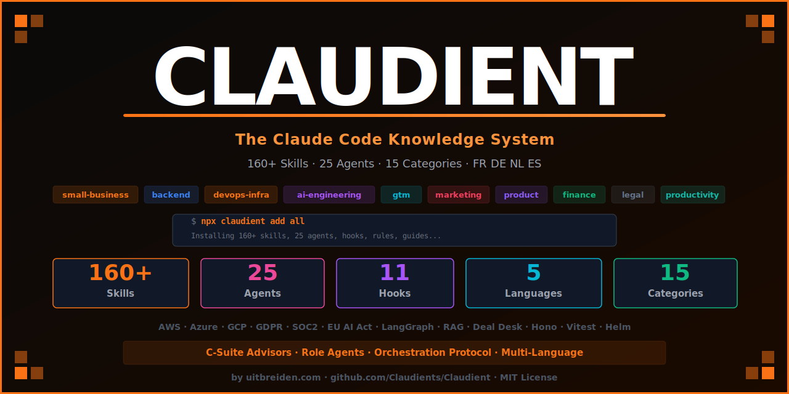

# Claudient — Skills, Agents & Plugins for Claude Code

[](https://www.npmjs.com/package/claudient)
[](https://www.npmjs.com/package/claudient)
[](LICENSE)
[](#skills-by-category)
[](#agents)
[](#translations)
[](https://www.reddit.com/r/uitbreiden/)
[](https://www.youtube.com/@UITBREIDEN)

> **The community knowledge system for Claude Code.** 160+ slash command skills, 25 advisor agents, hooks, rules, and orchestration protocols — for developers, vibe coders, GTM teams, legal, finance, and business owners.



```bash
npx claudient add all
```

---

## What is Claudient?

Claudient gives Claude Code **domain expertise on demand**. Instead of describing frameworks and patterns from scratch every session, you install skills that activate instantly.

```bash
# Install a skill
npx claudient add skills devops-infra

# Use it in Claude Code
/aws-architect     # Design AWS serverless architecture with IaC templates
/slo-architect     # Set up SLOs, error budgets, and burn rate alerts
/chaos-engineering # Plan failure injection experiments with rollback strategy
```

Every skill is a structured prompt with activation triggers, anti-patterns, concrete examples, and implementation steps — ready for Claude Code, not a generic chatbot.

---

## Quick Start

```bash
# First time — guided setup
npx claudient init

# Install everything (160+ skills, 25 agents, hooks, rules, guides)
npx claudient add all

# Install by role
npx claudient add skills backend       # Developer stack skills
npx claudient add skills marketing     # Growth and GTM skills
npx claudient add skills legal         # GDPR, SOC 2, EU AI Act
npx claudient add skills finance       # DCF, 3-statement model, pitch deck
npx claudient add agents               # All 25 advisor agents

# Install in your language
npx claudient add all --lang fr        # French
npx claudient add all --lang de        # German
npx claudient add all --lang nl        # Dutch
npx claudient add all --lang es        # Spanish

# Search and discover
npx claudient search "churn prevention"
npx claudient list
```

---

## Who uses Claudient?

| Audience | What they use |
|---|---|
| **Developers & vibe coders** | Next.js, Hono, Drizzle, Better Auth, Supabase, Railway, Vercel AI SDK |
| **AI product builders** | LangGraph, RAG Architect, Prompt Engineering, LLM Eval, MCP Server Builder |
| **DevOps & platform teams** | AWS/Azure/GCP Architect, Helm, Kubernetes, Terraform, Chaos Engineering |
| **GTM & RevOps teams** | HubSpot MCP, SDR Agent, Deal Desk, RFP Responder, Revenue Operations |
| **Marketing teams** | SEO Audit, Paid Ads, Copywriting, Analytics Tracking, Referral Programs |
| **Finance professionals** | DCF Model, 3-Statement Model, Pitch Deck, GL Reconciler, IC Memo |
| **Legal & compliance teams** | GDPR Expert, SOC 2, EU AI Act, ISO 27001, NDA Review, IP Clearance |
| **Product managers** | Product Discovery, UX Research, Experiment Designer, PM Toolkit |
| **C-suite & founders** | 14 advisor agents — CEO, CTO, CFO, CMO, COO, CPO, CDO, CAIO, CISO, VPE, CRO, CHRO, CCO, General Counsel |
| **Small business owners** | Invoicing, cash flow, Shopify, content, customer service — no code needed |

---

## 🏪 Claude for Small Business

> **Not a developer? Claudient works for you too.** Plain English skills, no terminal required.

```bash
npx claudient add skills small-business
```

| Skill | Automates | Works with |
|---|---|---|
| `/invoice-chaser` | AR reminders, payment escalation | QuickBooks, Stripe |
| `/quickbooks-workflow` | Month-end close, reconciliation | QuickBooks |
| `/cash-flow-forecast` | 30-day cash position, payroll runway | QuickBooks, PayPal |
| `/expense-audit` | Subscription creep, duplicate vendors | QuickBooks |
| `/content-repurposer` | 1 brief → blog + social + email + ads | Canva |
| `/review-response` | Google/Yelp review management | Google, Yelp |
| `/customer-inquiry` | FAQ responder, after-hours replies | Website, CRM |
| `/shopify-operations` | Product descriptions, inventory alerts | Shopify |
| `/sop-writer` | Standard operating procedures | Any business |
| `/weekly-pulse` | KPI dashboard from all your tools | Multi-tool |

---

## 🤖 25 Advisor Agents

Strategic thinking partners spawned with the `Agent` tool in Claude Code.

### C-Suite Advisors

| Agent | Domain |
|---|---|
| `ceo-advisor` | Company strategy, board prep, investor relations, org design |
| `cto-advisor` | Architecture decisions, build vs buy, technical strategy |
| `cmo-advisor` | GTM strategy, channel allocation, positioning, demand gen |
| `cfo-advisor` | Unit economics, fundraising, cash management, modelling |
| `coo-advisor` | Process design, OKRs, scaling operations |
| `cpo-advisor` | Roadmap, discovery, pricing, PLG strategy |
| `cro-advisor` | Revenue forecasting, NRR analysis, sales model design |
| `cdo-advisor` | AI training data rights, data architecture, M&A data valuation |
| `caio-advisor` | Model build-vs-buy, AI regulatory risk, self-hosting economics |
| `ciso-advisor` | Security programme design, risk prioritisation, board reporting |
| `vpe-advisor` | DORA metrics, eng hiring funnel, team structure |
| `chro-advisor` | Hiring strategy, compensation bands, performance management |
| `cco-advisor` | Customer lifecycle, retention decomposition, CS coverage model |
| `chief-of-staff` | Operating rhythm, OKR facilitation, CEO leverage |
| `general-counsel` | Legal risk, contract review, compliance overview |

### Role Specialists

| Agent | Domain |
|---|---|
| `incident-commander` | SEV classification, war room comms, PIR structure |
| `red-team` | Authorized adversary simulation, MITRE ATT&CK planning |
| `senior-backend` | API design, DB optimisation, auth patterns, code review |
| `senior-frontend` | React/Next.js architecture, performance, accessibility |

### Core Engineering Agents

`Planner` · `Architect` · `Code Reviewer` · `Security Reviewer` · `Python Build Resolver` · `TypeScript Build Resolver`

```bash
npx claudient add agents
```

---

## Orchestration Protocol

Combine agents and skills for multi-domain work — no framework, no dependencies.

```
Phase 1: cto-advisor + aws-architect + senior-backend   → Build
Phase 2: cmo-advisor + copywriting + content-strategy  → Launch  
Phase 3: ceo-advisor + pricing-strategy + analytics    → Scale
```

Read the [Orchestration Guide](guides/orchestration.md).

---

## ⭐ Most Popular Skills

### Vibe Coding
| Skill | What it does |
|---|---|
| [Next.js](skills/backend/nodejs/nextjs.md) | App Router, Server Components, Server Actions |
| [Hono](skills/backend/nodejs/hono.md) | Edge-native API on Cloudflare Workers + Bun |
| [Drizzle ORM](skills/database/drizzle.md) | TypeScript-first ORM, SQL-direct, Neon/Supabase |
| [Better Auth](skills/backend/nodejs/better-auth.md) | OAuth, 2FA, RBAC, open-source auth |
| [shadcn/ui](skills/backend/nodejs/shadcn.md) | Component library Claude reads and modifies |
| [Vercel AI SDK](skills/ai-engineering/vercel-ai-sdk.md) | Streaming AI, tool calls, useChat |

### AI Engineering
| Skill | What it does |
|---|---|
| [RAG Architect](skills/ai-engineering/rag-architect.md) | Chunking, embeddings, retrieval, reranking, eval |
| [LangGraph](skills/ai-engineering/langgraph.md) | Stateful agents, human-in-the-loop, checkpointing |
| [Prompt Engineering](skills/ai-engineering/prompt-engineering.md) | System prompts, few-shot, CoT, output formatting |
| [LLM Eval](skills/ai-engineering/llm-eval.md) | RAGAS, LLM-as-judge, production monitoring |
| [MCP Server Builder](skills/ai-engineering/mcp-server-builder.md) | Connect proprietary data to Claude Code |

### Cloud & DevOps
| Skill | What it does |
|---|---|
| [AWS Architect](skills/devops-infra/aws-architect.md) | Serverless, ECS, CloudFormation, cost optimisation |
| [Azure Architect](skills/devops-infra/azure-architect.md) | App Service, AKS, Bicep templates |
| [GCP Architect](skills/devops-infra/gcp-architect.md) | Cloud Run, GKE Autopilot, BigQuery pipelines |
| [Helm](skills/devops-infra/helm.md) | Chart authoring, values overrides, Helmfile |
| [SLO Architect](skills/devops-infra/slo-architect.md) | SLIs, error budgets, burn rate alerts |
| [Chaos Engineering](skills/devops-infra/chaos-engineering.md) | Failure injection, game days, blast radius |

### GTM & Revenue
| Skill | What it does |
|---|---|
| [HubSpot](skills/gtm/hubspot.md) | CRM automation via official MCP server |
| [Deal Desk](skills/gtm/deal-desk.md) | Enterprise deal structure, discount policy, red flags |
| [Revenue Operations](skills/gtm/revenue-operations.md) | GTM metrics, forecast accuracy, pipeline analysis |
| [RFP Responder](skills/gtm/rfp-responder.md) | Security questionnaires, bid scoring, response library |
| [Partnerships](skills/gtm/partnerships.md) | Tier classification, GTM plan, revenue share model |

### Compliance & Legal
| Skill | What it does |
|---|---|
| [GDPR Expert](skills/legal/gdpr-expert.md) | Privacy risk scan, DPIA generation, data subject rights |
| [SOC 2 Compliance](skills/legal/soc2-compliance.md) | Control matrix, evidence collection, audit readiness |
| [EU AI Act](skills/legal/eu-ai-act.md) | Risk tier classification, conformity assessment |
| [ISO 27001](skills/legal/iso27001.md) | ISMS gap analysis, risk assessment, SoA |
| [IP Clearance](skills/legal/ip-clearance.md) | Trademark search, FTO analysis, OSS licence audit |

### Finance
| Skill | What it does |
|---|---|
| [DCF Model](skills/finance/dcf-model.md) | WACC, FCF projection, sensitivity table |
| [3-Statement Model](skills/finance/3-statement-model.md) | P&L, balance sheet, cash flow — integrated |
| [Pitch Deck](skills/finance/pitch-deck.md) | Investor narrative, TAM/SAM/SOM, traction slide |
| [GL Reconciler](skills/legal/gdpr-expert.md) | Month-end close, journal entry review, variance analysis |
| [IC Memo](skills/finance/ic-memo.md) | 9-section investment committee memo |

### Productivity & Engineering
| Skill | What it does |
|---|---|
| [Ship Gate](skills/productivity/ship-gate.md) | Pre-production audit: security, DB, auth, deps — blocks deploys |
| [PR Review](skills/productivity/pr-review.md) | Blast radius, security scan, breaking change detection |
| [Spec-Driven Workflow](skills/productivity/spec-driven-workflow.md) | Spec → tests → implementation pattern |
| [Tech Debt Tracker](skills/productivity/tech-debt-tracker.md) | Debt register, prioritisation, leadership brief |
| [Git Worktree](skills/productivity/git-worktree.md) | Parallel branches, Claude Code isolation pattern |

---

## Skills by Category

**15 categories · 160+ skills · EN · FR · DE · NL · ES**

| Category | Skills |
|---|---|
| `small-business` | Invoice Chaser, QuickBooks, Cash Flow, Expense Audit, Content Repurposer, Campaign Brief, Review Response, Customer Inquiry, Shopify, Job Description, SOP Writer, Weekly Pulse |
| `backend/nodejs` | Next.js, Hono, Express, NestJS, React, Vue 3, TypeScript Advanced, Better Auth, shadcn/ui, tRPC, Astro, Svelte, Wasp, Payload CMS |
| `backend/python` | FastAPI, Django, pytest, Python Async, API Design |
| `backend/go` · `backend/dotnet` · `backend/java` | Go, C#/.NET, Spring Boot |
| `devops-infra` | AWS/Azure/GCP Architect, Kubernetes, Helm, Terraform, Docker, GitHub Actions, CI/CD, Sentry, OpenTelemetry, Secrets Management, SLO Architect, Observability Designer, Chaos Engineering, Release Manager, Migration Architect + 10 more |
| `database` | Drizzle ORM, Prisma, PostgreSQL, Supabase, Neon, Redis, MongoDB, GraphQL |
| `data-ml` | Pandas/Polars, PyTorch/TF, dbt, MLflow, Spark, SQL, Synthetic Data |
| `ai-engineering` | Claude API, Vercel AI SDK, LangGraph, Mastra AI, MCP Server Builder, RAG Architect, Prompt Engineering, LLM Eval |
| `gtm` | HubSpot, SDR Agent, Lead Enrichment, Email Automation, CRM Hygiene, Customer Success, Revenue Ops, Deal Desk, RFP Responder, Partnerships |
| `marketing` | SEO Audit, AI SEO, Programmatic SEO, Paid Ads, Content Strategy, Copywriting, Analytics Tracking, Onboarding CRO, Referral Program, Brand Guidelines, Pricing Strategy + more |
| `product` | Product Discovery, Product Analytics, Competitive Teardown, Experiment Designer, Product Roadmap, UX Researcher, PM Toolkit, Landing Page Generator |
| `finance` | DCF Model, 3-Statement Model, Comps Analysis, IC Memo, Pitch Deck, KYC Screener, Financial Plan, Earnings Analysis, Deal Screening, GL Reconciler |
| `legal` | Contract Review, NDA Review, Termination Review, DSAR Response, AI Impact Assessment, OSS License Review, Privacy PIA, GDPR Expert, SOC 2, EU AI Act, ISO 27001, IP Clearance, Vendor Contract Review, Brief Section Drafter, Diligence Review |
| `productivity` | Ship Gate, PR Review, API Test Builder, Spec-Driven Workflow, Tech Debt Tracker, Jira Expert, Scrum Master, Confluence Expert, Git Worktree, Self-Eval, Env Secrets Manager, Runbook Generator, Lit Review, Grants Writer, Research Dossier, Trend Monitor |
| `automation` | Browser Automation, Playwright Pro |
| `git` | Commit Writer, PR Description, Changelog Generator |

---

## What's Included

| Type | Count | Description |
|---|---|---|
| **Skills** | **160+** | Slash commands for every major stack, workflow, and business domain |
| **Agents** | **25** | C-suite advisors · role specialists · engineering core |
| **Hooks** | 11 | Secret scanner, test runner, lint check, daily summary, cost tracker + more |
| **Rules** | 12 | API design, error handling, database migrations, AI/LLM, performance, testing |
| **Workflows** | 10 | Incident response, API design, database migration, security review, feature launch |
| **Guides** | 15 | MCP integration, prompt injection defense, multi-agent patterns, deployment patterns + more |
| **Prompts** | 14+ | Code reviewer, security auditor, product spec writer, startup advisor, data analyst |

All skills available in **EN · FR · DE · NL · ES**

---

## Hooks

| Hook | Event | What it does |
|---|---|---|
| `secret-scanner.sh` | PreToolUse | Blocks writes containing API keys or credentials |
| `lint-check.sh` | PostToolUse | Auto-lints TypeScript/Python after every file edit |
| `test-runner.sh` | PostToolUse | Runs related tests after editing a source file |
| `block-dangerous.sh` | PreToolUse | Blocks destructive shell commands |
| `git-push-confirm.sh` | PreToolUse | Confirms before `git push` |
| `audit-log.sh` | PostToolUse | Logs every tool call to a session file |
| `prettier.sh` | PostToolUse | Auto-formats after Write/Edit |
| `cost-tracker.sh` | PostToolUse | Tracks token costs per session |
| `daily-summary.sh` | Stop | Appends session summary to daily log |
| `pre-compact-save.sh` | PreCompact | Saves state before compaction |
| `session-start.sh` | Notification | Prints branch + context on session start |

---

## Guides

| Guide | What it covers |
|---|---|
| [Orchestration](guides/orchestration.md) | Multi-phase agent + skill coordination protocol |
| [Multi-Agent Patterns](guides/multi-agent-patterns.md) | Parallel, pipeline, specialist, map-reduce patterns |
| [MCP Integration](guides/mcp-integration.md) | Connect external tools and databases to Claude Code |
| [Prompt Injection Defense](guides/prompt-injection-defense.md) | Protect AI apps from injection attacks |
| [Context Management](guides/context-management.md) | Context window strategies, CLAUDE.md, /compact |
| [Cost Optimisation](guides/cost-optimisation.md) | Model selection, caching, batch API, monitoring |
| [Deployment Patterns](guides/deployment-patterns.md) | Rolling, blue-green, canary, feature flags |
| [CLAUDE.md Architecture](guides/claude-md-architecture.md) | Structuring for solo/team/monorepo |
| [Getting Started](guides/getting-started.md) | Setup, first skill, first hook |
| [Security](guides/security.md) | Isolation, approval, sanitization |

---

## CLI Reference

```bash
npx claudient init                          # Guided first-time setup
npx claudient add all                       # Install everything
npx claudient add skills                    # All 160+ skills
npx claudient add skills devops-infra       # Specific category
npx claudient add skills marketing
npx claudient add skills legal
npx claudient add skills finance
npx claudient add agents                    # All 25 agents
npx claudient add hooks                     # All hooks
npx claudient add all --lang fr             # French version
npx claudient search "circuit breaker"      # Find by name/description
npx claudient list                          # Browse all content
npx claudient remove skills productivity    # Remove a category
```

---

## Translations

Every skill, agent, guide, workflow, and prompt in:

**🇬🇧 English · 🇫🇷 French · 🇩🇪 German · 🇳🇱 Dutch · 🇪🇸 Spanish**

```bash
npx claudient add all --lang de   # German
npx claudient add all --lang nl   # Dutch
```

---

## Contributing

Claudient is community-powered. To add skills, agents, or hooks:

1. Read the [Skill Authoring Guide](guides/skill-authoring.md)
2. Open a PR following the [file format](CLAUDE.md)
3. Skills go live after review

**[GitHub Discussions](https://github.com/Claudients/Claudient/discussions) · [CONTRIBUTING.md](CONTRIBUTING.md)**

---

## Built by Uitbreiden

Claudient is backed by [Uitbreiden](https://uitbreiden.com/) — building AI products and B2B tools with developer communities.

[](https://www.reddit.com/r/uitbreiden/)
[](https://www.youtube.com/@UITBREIDEN)
[](https://uitbreiden.com/)

---

## License

MIT — free to use, modify, and distribute.
