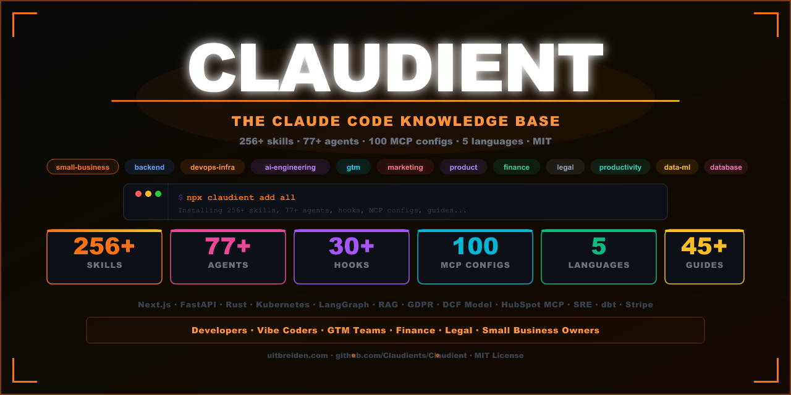

# Claudient — The Claude Code Knowledge Base

[](https://www.npmjs.com/package/claudient)
[](https://www.npmjs.com/package/claudient)
[](https://github.com/Claudient/Claudient)
[](LICENSE)
[](#skills-by-category)
[](#agents)
[](#top-100-mcp-servers)
[](#translations)
[](https://www.reddit.com/r/uitbreiden/)
[](https://www.youtube.com/@UITBREIDEN)

**Stop explaining your stack to Claude every session.**

Claudient gives Claude Code instant domain expertise — 256+ skills that activate automatically, 77+ specialist agents, configs for the top 100 MCP servers, and hooks that automate your workflow. Install in 30 seconds, works with any Claude Code project.

```bash
npx claudient add all
```



---

## Who is this for?

| You are... | You get... |
|---|---|
| **Developer / vibe coder** | Skills for Next.js, FastAPI, Rust, Go, Drizzle, tRPC, Docker, k8s, Terraform, and 200+ more stacks — activate with a slash command |
| **AI product builder** | RAG Architect, LangGraph, Prompt Engineering, LLM Eval, MCP Server Builder, Claude API patterns with prompt caching |
| **GTM / RevOps engineer** | HubSpot MCP, SDR Agent, Lead Enrichment, CRM Hygiene, Email Automation, Deal Desk |
| **Finance / Legal professional** | DCF models, 3-statement models, IC memos, contract review, GDPR, SOC 2, EU AI Act — with mandatory human review gates |
| **Small business owner** | Plain-English skills for invoicing, cash flow, Shopify, reviews, SOPs — no terminal required |
| **DevOps / Platform team** | SLO design, chaos engineering, Helm, Kubernetes, Terraform, SRE runbooks, cost tracking |

---

## ⚡ Quick Start

```bash
# Install everything
npx claudient add all

# Install by domain
npx claudient add skills backend          # 80+ backend skills
npx claudient add skills devops-infra     # Kubernetes, Terraform, Docker, CI/CD
npx claudient add skills ai-engineering   # RAG, LangGraph, Claude API, MCP builder
npx claudient add skills legal            # GDPR, SOC 2, contracts, NDA review
npx claudient add skills finance          # DCF, 3-statement model, pitch deck
npx claudient add skills small-business   # Invoice chaser, cash flow, Shopify

# Install agents
npx claudient add agents                  # All 77+ specialist agents

# Install in your language
npx claudient add all --lang fr           # French
npx claudient add all --lang de           # German
npx claudient add all --lang nl           # Dutch
npx claudient add all --lang es           # Spanish

# Discover
npx claudient search "circuit breaker"
npx claudient list
```

---

## 🔥 Most Popular Right Now

| Skill / Agent | What it does | Category |
|---|---|---|
| `/nextjs-app` | Next.js App Router, Server Components, Server Actions, Drizzle | Backend |
| `/fastapi` | Production FastAPI with auth, Pydantic, async, tests, Docker | Backend |
| `/sre-engineer` | SLO design, error budgets, burn rate alerts, runbooks | Agent |
| `/security-audit` | OWASP Top 10 scan, secret exposure check before every PR | Agent |
| `/invoice-chaser` | Automated AR reminders and payment escalation (no code needed) | Small Business |
| `/hubspot` | CRM automation via the official HubSpot MCP server | GTM |
| `/rag-architect` | Chunking strategy, embeddings, retrieval, reranking, eval | AI Engineering |
| `/kubernetes-architect` | K8s manifests, Helm charts, HPA, NetworkPolicy, RBAC | DevOps |

---

## 🔌 Top 100 MCP Servers for Indie Builders

> **The fastest way to extend Claude Code.** MCP servers give Claude direct access to your tools — GitHub, Figma, Stripe, Jira, Notion, Slack, and 94 more.

**The indie builder starter stack:**

| Server | What it does | Monthly searches |
|--------|-------------|-----------------|
| [Playwright MCP](mcp/playwright-mcp.md) | Browser automation — navigate, click, screenshot, scrape | 82K |
| [Figma MCP](mcp/figma.md) | Read designs, extract tokens, generate components from specs | 74K |
| [GitHub MCP](mcp/github.md) | Read PRs, create issues, search code, manage releases | 69K |
| [Atlassian MCP](mcp/atlassian.md) | Jira tickets, Confluence docs, sprint management | 40K |
| [Memory MCP](mcp/memory.md) | Persistent knowledge graph across Claude Code sessions | — |
| [Stripe MCP](mcp/stripe.md) | Query customers, subscriptions, payments, churn data | — |
| [Notion MCP](mcp/notion.md) | Read/write pages, query databases, create docs | — |
| [Taskmaster MCP](mcp/taskmaster.md) | AI task management with context isolation across sessions | — |

**→ [Full guide: Top 100 MCP Servers for Indie Builders](mcp/top-mcp-servers.md)** — installation configs, tier rankings, and curated bundles for every stack.

```bash
npx claudient add mcp starter   # GitHub + Memory + Playwright
npx claudient add mcp all       # All 20 individual config guides
```

---

## 🏪 Claude for Small Business

> **Not a developer? Claudient works for you too.** Plain English skills, no terminal required.

```bash
npx claudient add skills small-business
```

| Skill | Automates | Works with |
|---|---|---|
| `/invoice-chaser` | AR reminders, payment escalation | QuickBooks, Stripe |
| `/quickbooks-workflow` | Month-end close, reconciliation | QuickBooks |
| `/cash-flow-forecast` | 30-day cash position, payroll runway | QuickBooks, PayPal |
| `/expense-audit` | Subscription creep, duplicate vendors | QuickBooks |
| `/content-repurposer` | 1 brief → blog + social + email + ads | Canva |
| `/review-response` | Google/Yelp review management | Google, Yelp |
| `/customer-inquiry` | FAQ responder, after-hours replies | Website, CRM |
| `/shopify-operations` | Product descriptions, inventory alerts | Shopify |
| `/sop-writer` | Standard operating procedures | Any business |
| `/weekly-pulse` | KPI dashboard from all your tools | Multi-tool |

---

## 🤖 77+ Agents

Specialist agents spawned with the `Agent` tool in Claude Code. Each has a specific model, tool restrictions, and trigger conditions.

### C-Suite Advisors (15 agents)

| Agent | Domain |
|---|---|
| `ceo-advisor` | Strategy, board prep, investor relations, org design |
| `cto-advisor` | Architecture decisions, build vs buy, technical strategy |
| `cfo-advisor` | Unit economics, fundraising, cash management, modelling |
| `cmo-advisor` | GTM strategy, channel allocation, positioning, demand gen |
| `ciso-advisor` | Security programme design, risk prioritisation, board reporting |
| `coo-advisor` | Process design, OKRs, scaling operations |
| `cpo-advisor` | Roadmap, discovery, pricing, PLG strategy |
| `cro-advisor` | Revenue forecasting, NRR analysis, sales model design |
| `general-counsel` | Legal risk, contract review, compliance overview |
| `chief-of-staff` | Operating rhythm, OKR facilitation, CEO leverage |
| + 5 more | CDO, CAIO, VPE, CHRO, CCO |

### Engineering Specialists

`sre-engineer` · `chaos-engineer` · `penetration-tester` · `kubernetes-architect` · `security-auditor` · `platform-engineer` · `network-engineer` · `rust-engineer` · `mlops-engineer` · `graphql-architect` · `websocket-engineer` · `fullstack-developer` · `llm-architect` · `codebase-orchestrator` · `multi-agent-coordinator` + 30 more

### Domain Specialists

`competitive-analyst` · `market-researcher` · `trend-analyst` · `quant-analyst` · `fintech-engineer` · `healthcare-admin` · `legal-advisor` · `nlp-engineer` · `data-pipeline-architect` + more

```bash
npx claudient add agents
```

---

## 📦 Skills by Category

**256+ skills · 15 categories · EN · FR · DE · NL · ES**

| Category | Count | Top skills |
|---|---|---|
| `backend/nodejs` | 20+ | Next.js, Hono, NestJS, tRPC, Astro, Svelte, React Native, Angular, WebSockets |
| `backend/python` | 5 | FastAPI, Django, pytest, Python Async |
| `backend/other` | 8 | Go, C#/.NET, Spring Boot, Rust, Rails, Laravel, Elixir, Flutter |
| `devops-infra` | 20+ | AWS/Azure/GCP, Kubernetes, Helm, Terraform, Terragrunt, Docker, GitHub Actions, Sentry, OpenTelemetry |
| `ai-engineering` | 10+ | Claude API, Vercel AI SDK, LangGraph, RAG Architect, Prompt Caching, Batch API, MCP Builder |
| `data-ml` | 8 | dbt, Spark, Kafka, MLOps, NLP Pipelines, Reinforcement Learning, Pandas/Polars, PyTorch |
| `database` | 8 | Drizzle, Prisma, PostgreSQL, Supabase, Neon, Redis, Elasticsearch, Blockchain/Solidity |
| `gtm` | 10 | HubSpot, SDR Agent, Lead Enrichment, Email Automation, CRM Hygiene, Deal Desk, Revenue Ops |
| `legal` | 15 | Contract Review, NDA, DSAR, GDPR, SOC 2, EU AI Act, ISO 27001, IP Clearance, Privacy PIA |
| `finance` | 10 | DCF Model, 3-Statement Model, IC Memo, Pitch Deck, KYC Screener, GL Reconciler |
| `marketing` | 10 | SEO Audit, AI SEO, Programmatic SEO, Paid Ads, Content Strategy, CRO, Copywriting |
| `product` | 8 | Product Discovery, Experiment Designer, Competitive Teardown, UX Research, Roadmap |
| `productivity` | 20+ | Ship Gate, PR Review, ADR Writer, Tech Debt Tracker, Context Engineering, TDD Guard |
| `small-business` | 12 | Invoice Chaser, QuickBooks, Cash Flow, Shopify, SOP Writer, Review Response |
| `automation` | 6 | Playwright Pro, Browser Automation, Remotion, SaaS Scaffolder, Office Docs |

---

## 🪝 Hooks

Event-driven automation — runs outside Claude's context as real shell processes.

| Hook | Event | What it does |
|---|---|---|
| `secret-scanner` | PreToolUse | Blocks writes containing API keys or credentials |
| `tdd-guard` | PostToolUse | Blocks implementation files without a matching test |
| `injection-scanner` | PreToolUse | Scans tool inputs for prompt injection attempts |
| `plannotator` | ExitPlanMode | Interactive plan annotation before Claude executes |
| `lint-check` | PostToolUse | Auto-lints TypeScript/Python after every file edit |
| `test-runner` | PostToolUse | Runs related tests after editing a source file |
| `telegram-pr-notify` | PostToolUse | Sends Telegram message when a PR is created |
| `keepalive-poke` | Stop | Continues autonomous sessions without intervention |
| `sound-system` | All events | Platform-native sounds for 27 Claude Code events |
| `session-context-loader` | SessionStart | Injects date, branch, recent commits at session start |
| `ntfy-push` | Notification | Mobile push alerts via ntfy |
| `tts-announcer` | Stop | Speaks Claude's final message aloud |
| + 20 more | — | Auto-stage git, transcript backup, output compressor, bug logger, Slack notifier, WhatsApp gate... |

---

## 📖 Guides & Workflows

### Guides (45+)

[Getting Started](guides/getting-started.md) · [Agent Frontmatter Reference](guides/agent-frontmatter.md) · [Skills Frontmatter Reference](guides/skills-frontmatter.md) · [Decision Framework](guides/decision-framework.md) · [Claude Managed Agents](guides/claude-managed-agents.md) · [Advanced Tool Use](guides/advanced-tool-use.md) · [Voice Dictation](guides/voice-dictation.md) · [Desktop App](guides/desktop-app.md) · [Opus 4.7 Migration](guides/opus-47-migration.md) · [Hooks Cookbook](guides/hooks-cookbook.md) · [Multi-Agent Patterns](guides/multi-agent-patterns.md) · [Subagent Patterns](guides/subagent-patterns.md) · [Context Management](guides/context-management.md) · [Token Cost Reduction](guides/token-cost-reduction.md) · [Notifications Setup](guides/notifications-setup.md) · [Plugin Authoring](guides/plugin-authoring.md) · [RIPER Framework](guides/riper-framework.md) · [RPI Workflow](guides/rpi-workflow.md) · [CLI Reference](guides/cli-reference.md) · [Settings Scope](guides/settings-scope.md) · [Why Use Claude Code](guides/why-use-claude-code.md) · [Routines](guides/routines.md) · [Computer Use](guides/computer-use.md) · [Ultraplan](guides/ultraplan.md) · [Auto Mode](guides/auto-mode.md) + 10 more

### Workflows (20+)

[RPI Feature Development](workflows/rpi-feature.md) · [RIPER](workflows/riper.md) · [Incremental Build](workflows/incremental-build.md) · [Pre-Human Review](workflows/pre-human-review.md) · [Autonomous Loop](workflows/autonomous-loop.md) · [Worktree Lifecycle](workflows/worktree-lifecycle.md) · [Multi-Agent Saga](workflows/multi-agent-saga.md) · [Chaos Game Day](workflows/chaos-game-day.md) · [Error Budget](workflows/error-budget.md) · [Bug Investigation](workflows/bug-investigation.md) · [Compound Engineering](workflows/compound-engineering.md) · [Session Learning](workflows/session-learning.md) + more

---

## 📊 What's Included

| Type | Count |
|---|---|
| **Skills** | **256+** |
| **Agents** | **77+** |
| **Hooks** | 30+ |
| **MCP config guides** | 25+ |
| **Guides** | 45+ |
| **Workflows** | 20+ |
| **Prompts** | 15+ |
| **Rules** | 9 |
| **Languages** | 5 (EN · FR · DE · NL · ES) |

---

## 🌍 5 Languages

Every skill, agent, guide, workflow, and prompt is available in:

**🇬🇧 English · 🇫🇷 French · 🇩🇪 German · 🇳🇱 Dutch · 🇪🇸 Spanish**

```bash
npx claudient add all --lang fr   # French
npx claudient add all --lang de   # German
npx claudient add all --lang nl   # Dutch
npx claudient add all --lang es   # Spanish
```

---

## 🤝 Add Your Skill — Get Featured

Claudient is community-powered. Every skill lives in one markdown file.

1. Read the [Skill Authoring Guide](guides/skill-authoring.md) — 5 minutes
2. Fork, add your skill in one `.md` file
3. Submit a PR — merged skills get featured in **Most Popular**

**[GitHub Discussions](https://github.com/Claudients/Claudient/discussions) · [CONTRIBUTING.md](CONTRIBUTING.md) · [Reddit](https://www.reddit.com/r/uitbreiden/)**

---

## Built by Uitbreiden

Claudient is backed by [Uitbreiden](https://uitbreiden.com/) — building AI products and B2B tools with developer communities.

[](https://www.reddit.com/r/uitbreiden/)
[](https://www.youtube.com/@UITBREIDEN)
[](https://uitbreiden.com/)

---

## License

MIT — free to use, modify, and distribute.
