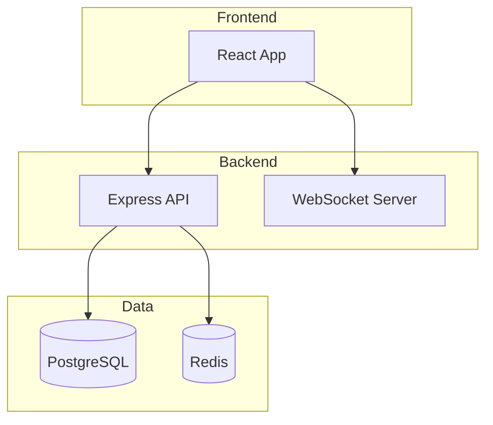
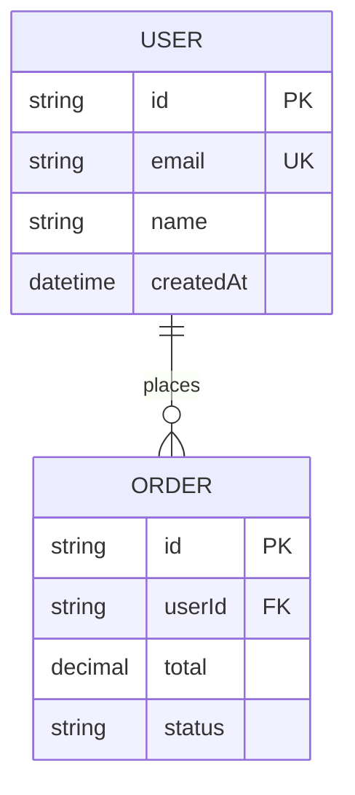
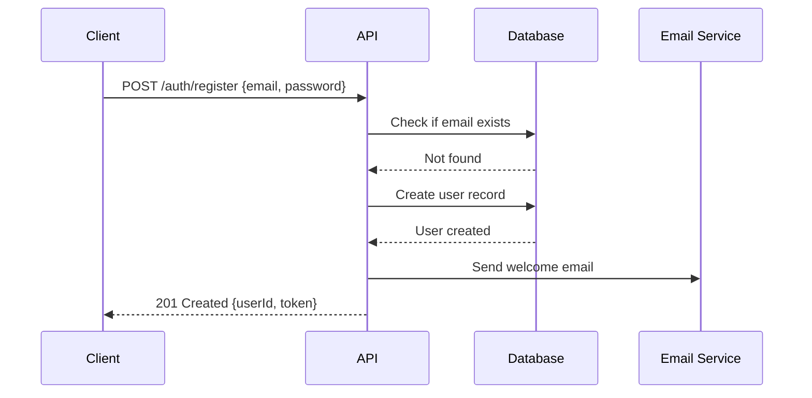
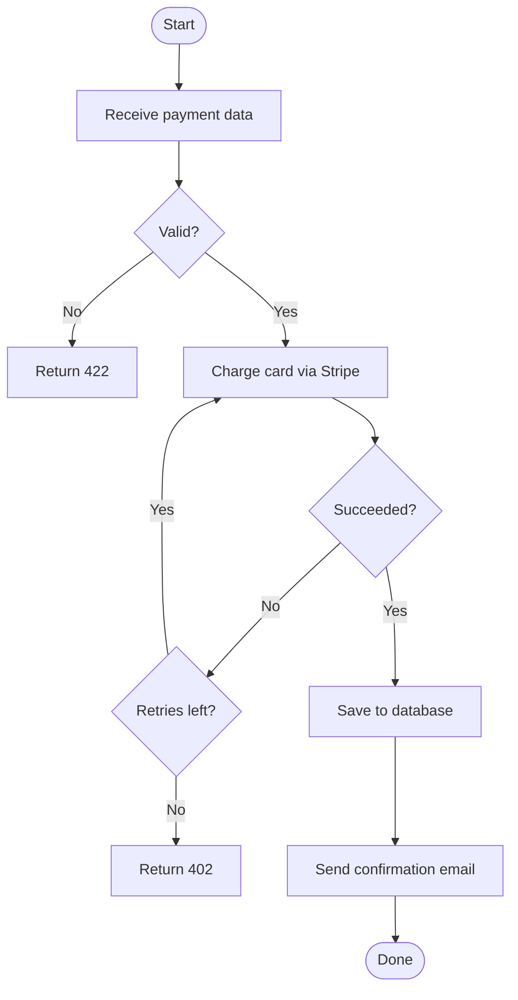
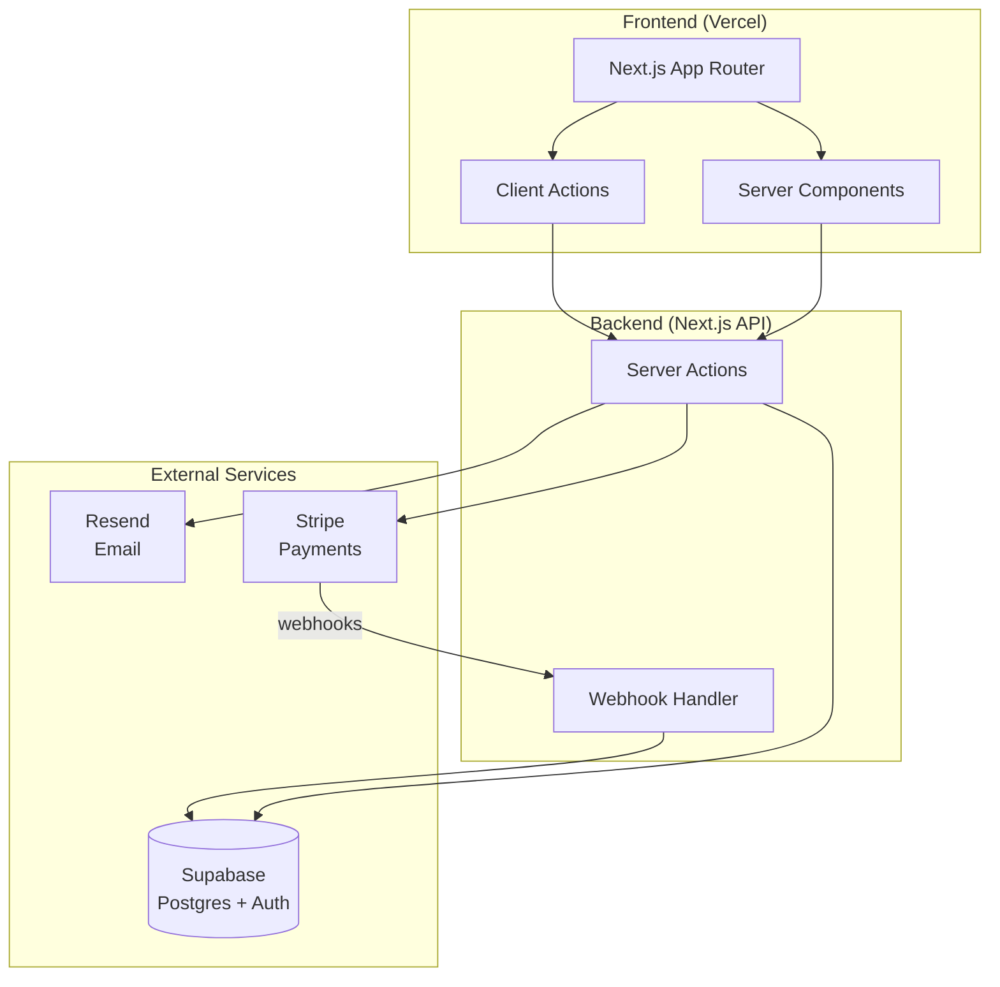

# Diagram Generator Agent

## Purpose
Convert code structure, architecture descriptions, API flows, and data models into clear visual diagrams using Mermaid syntax, ASCII art, or Excalidraw JSON — without leaving Claude Code.

## Model guidance
Haiku — diagram generation is structured output with clear patterns; Haiku handles it efficiently and cheaply.

## Tools
- Read (source files, schema files, CLAUDE.md, architecture docs)
- Write (diagram output files)

## When to delegate here
- Generating an architecture diagram from a codebase description
- Converting a Prisma/Drizzle schema to an ER diagram
- Creating a sequence diagram for an API flow or authentication process
- Drawing a service dependency map from microservices code
- Generating a flowchart from a complex function or workflow

## Instructions

### Mermaid diagrams (GitHub-native, docs-friendly)

**Architecture diagram:**
```
Read the codebase and generate a Mermaid architecture diagram.

Focus on: services, databases, external APIs, and data flow between them.

Output format:

```

**ER diagram from schema:**
```
Read the database schema (Prisma/Drizzle/SQL) and generate a Mermaid ER diagram.


```

**Sequence diagram:**
```
Generate a sequence diagram for [flow].


```

**Flowchart:**
```
Generate a flowchart for [function/process].


```

### ASCII diagrams (terminal-friendly)

For README files and documentation that must render in plain text:

```
Architecture (ASCII):

┌─────────────────┐     ┌─────────────────┐
│   React App     │────▶│   Express API   │
│  (Vercel)       │     │   (Railway)     │
└─────────────────┘     └────────┬────────┘
                                  │
                    ┌─────────────┴──────────┐
                    │                        │
             ┌──────▼──────┐     ┌──────────▼────┐
             │ PostgreSQL  │     │    Redis       │
             │  (Neon)     │     │   (Upstash)    │
             └─────────────┘     └───────────────┘
```

### Excalidraw JSON

For richer diagrams with visual styling (open in excalidraw.com):

```
Generate Excalidraw JSON for [diagram type].
Save to: docs/architecture.excalidraw
Format: Valid Excalidraw JSON with elements array
Include: boxes for services, arrows for connections, labels
```

## Example use case

**User:** I just built a Next.js app with Supabase, Stripe, and Resend. Generate the architecture diagram for my README.

**Agent output:**



Saved to: `docs/architecture.md`

---
