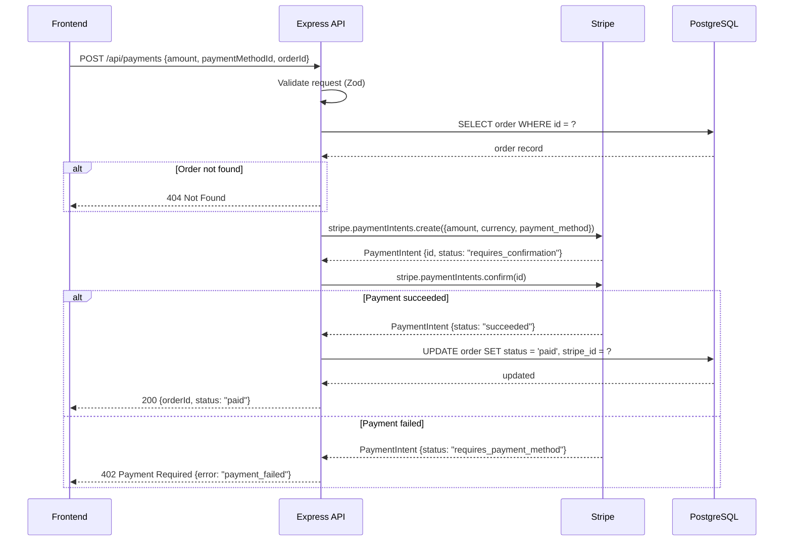

# Mermaid Skill

## When to activate
- Creating a flowchart for a process or algorithm
- Drawing a sequence diagram for an API flow or authentication
- Generating an ER diagram from a database schema
- Building a state machine diagram for a workflow
- Adding diagrams to README files, GitHub PRs, or Notion docs

## When NOT to use
- Complex architecture diagrams with many services — use the diagram-generator agent for richer output
- Presentations or polished visuals — export to SVG and style separately
- Real-time collaborative whiteboarding — use Excalidraw

## Instructions

### Flowchart

```
Create a Mermaid flowchart for [process].

Process: [describe the flow — steps, decisions, branches, end states]

Standard flowchart syntax:
graph TD
  Start([Start]) --> Step1[Action or step]
  Step1 --> Decision{Decision?}
  Decision -->|Yes| Path1[Result A]
  Decision -->|No| Path2[Result B]
  Path1 --> End([End])
  Path2 --> End

Node shapes:
([text])  = rounded ends (start/end)
[text]    = rectangle (process step)
{text}    = diamond (decision)
((text))  = circle (connector)
>text]    = asymmetric (note/comment)

Direction options:
TD = top to bottom (default for flows)
LR = left to right (good for timelines)
BT = bottom to top
RL = right to left

Generate the flowchart for my process.
```

### Sequence diagram

```
Create a Mermaid sequence diagram for [interaction].

Participants: [list actors — User, Frontend, API, Database, etc.]
Flow: [describe the steps in order]

Syntax:
sequenceDiagram
  participant U as User
  participant A as API
  participant D as Database
  
  U->>A: POST /login {email, password}
  A->>D: SELECT user WHERE email = ?
  D-->>A: user record
  A->>A: verify password hash
  A-->>U: 200 {token}

Arrow types:
->>  = solid arrow (request/message)
-->> = dashed arrow (response/return)
-x   = failed message
--)  = async message (open arrowhead)

Features:
Note over A,D: This is a note
activate A / deactivate A = show activation bars
loop [label] / end = loop block
alt [condition] / else / end = conditional block

Generate the sequence diagram for my interaction.
```

### ER diagram

```
Create a Mermaid ER diagram from [schema or description].

Tables: [list tables with columns and types]

Syntax:
erDiagram
  USERS {
    string id PK
    string email UK "must be unique"
    string name
    datetime created_at
  }
  ORDERS {
    string id PK
    string user_id FK
    decimal total
    string status
    datetime created_at
  }
  USERS ||--o{ ORDERS : "places"

Relationship notation:
||--||  = exactly one to exactly one
||--o{  = exactly one to zero or more (one-to-many)
}|--|{  = one or more to one or more
}o--o{  = zero or more to zero or more

Generate the ER diagram from my schema.
```

### State machine

```
Create a Mermaid state diagram for [entity/workflow].

States: [list possible states]
Transitions: [list events that cause state changes]

Syntax:
stateDiagram-v2
  [*] --> Draft
  Draft --> Submitted : submit()
  Submitted --> UnderReview : assign_reviewer()
  UnderReview --> Approved : approve()
  UnderReview --> Rejected : reject()
  UnderReview --> Draft : request_changes()
  Approved --> Published : publish()
  Rejected --> [*]
  Published --> [*]

  state UnderReview {
    [*] --> Reviewing
    Reviewing --> WaitingForResponse : request_info()
    WaitingForResponse --> Reviewing : info_received()
  }

Generate the state diagram for my workflow.
```

### Rendering Mermaid

Mermaid renders natively in:
- **GitHub** — paste in any markdown file, README, PR description, or issue
- **Notion** — `/mermaid` block
- **GitLab** — code blocks with `mermaid` language tag
- **Obsidian** — native support
- **VS Code** — Markdown Preview Mermaid Support extension
- **Docs sites** — Docusaurus, MkDocs Material, Gatsby

Render live: [mermaid.live](https://mermaid.live)

## Example

**User:** Draw a sequence diagram for how our Express API handles a payment — from the frontend request to Stripe to the database.

**Claude generates:**



---
