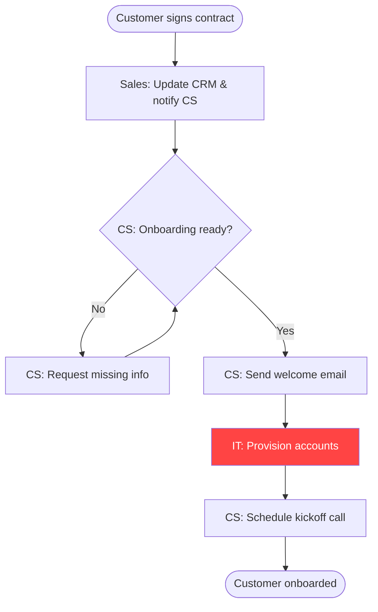

# Compétence : Cartographie de Processus

## Quand activer
- Documentation d'un processus existant qui ne vit que dans la tête de quelqu'un
- Cartographie d'un nouveau processus avant de construire un SOP ou un support de formation
- Identification des points où les transferts échouent, les étapes ralentissent ou le travail est abandonné
- Création d'une matrice RACI pour des processus transversaux avec une ownership peu claire
- Préparation d'un audit de processus, d'une certification ISO ou d'une revue opérationnelle
- Avant d'automatiser un workflow — cartographier manuellement d'abord, puis éliminer les gaspillages

## Quand NE PAS utiliser
- Vous avez déjà un processus entièrement documenté et à jour — utilisez `/sop-writer` pour le mettre à jour
- Le processus n'implique qu'une seule personne sans transfert — utilisez une simple liste de contrôle
- Vous cartographiez une architecture de système technique — c'est un type de diagramme différent
- Le processus n'existe pas encore et vous devez le concevoir de zéro — commencez d'abord par une session de conception de workflow

## Instructions

### Prompt de cartographie de processus complet

```
Map the following business process end-to-end.

Process name: [e.g., Customer onboarding, Invoice approval, Vendor procurement]
Trigger: [What starts this process? e.g., New customer signs contract]
End state: [What does "done" look like? e.g., Customer has logged in and completed setup]
Participants: [List all roles involved — e.g., Sales, Customer Success, Finance, IT]
Tools/systems involved: [CRM, ERP, email, Slack, etc.]

Known pain points (if any): [what you already know is broken or slow]

Produce:

## 1. Process overview
- Start trigger
- End state
- Estimated total duration (best case / worst case)
- Number of handoffs
- Systems touched

## 2. Step-by-step process map
For each step:
- Step name
- Who does it (role, not person)
- Input: what they receive
- Output: what they produce
- Tool/system used
- Estimated time
- Common failure mode

Format as a numbered table with columns: # | Step | Owner | Input | Output | Tool | Time | Failure Mode

## 3. RACI matrix
Map each step to: Responsible / Accountable / Consulted / Informed
Rules:
- Only ONE person can be Accountable per step (if multiple, that's a problem)
- Responsible does the work. Accountable owns the outcome. Don't confuse them.
- Consulted = must be asked before action. Informed = told after.

## 4. Bottleneck analysis
Identify steps where:
- Cycle time is disproportionate to value added
- Handoffs fail or are delayed most often
- The same rework or error occurs repeatedly
- A single person is a chokepoint (key-person dependency)

Score each step: Green (smooth) / Amber (delays common) / Red (frequent failures)

## 5. Improvement recommendations
For each Red/Amber step:
- Root cause (why does this fail?)
- Quick fix (< 1 week, no new tools)
- Medium fix (2-4 weeks, may require new tooling)
- Process owner for the fix
- Estimated impact: [time saved / error rate reduction / cost saved]

## 6. Automation opportunities
Which steps are candidates for automation?
Criteria: repetitive, rule-based, high volume, low judgment required
For each candidate: what tool/system would handle it, and what's the ROI estimate?
```

### Esquisse rapide de processus (version 10 minutes)

```
Give me a quick process map for: [PROCESS NAME]

Context:
- Who triggers it: [role]
- Who finishes it: [role]
- Approximate steps: [N]
- Main handoff points: [list them]

Output:
1. Linear step list with owner and tool for each step
2. Top 2 bottlenecks (where it usually breaks)
3. One improvement recommendation
```

### Générateur de matrice RACI

```
Build a RACI matrix for the following process.

Process: [name]
Steps: [list each step, numbered]
Roles involved: [list all roles, e.g., Ops Manager, Finance, IT, Legal, CEO]

Rules to apply:
1. Exactly one Accountable per step — if you'd put two, flag it as an ownership problem
2. If Consulted > 3 per step, flag it as decision bottleneck
3. If a role appears as Accountable on > 50% of steps, flag key-person dependency

Output:
- Full RACI table (rows = steps, columns = roles)
- Ownership problems identified (shared accountability / no accountability)
- Bottleneck roles (overloaded with Responsible or Consulted)
- Recommendation: which role should own this process end-to-end?
```

### Analyse approfondie du goulot d'étranglement

```
I have a process with a known bottleneck at step: [STEP NAME]

What we know:
- Average time this step takes: [X hours/days]
- Expected time it should take: [X hours/days]
- Who owns it: [role]
- What causes delays (from observation): [list known causes]
- Downstream impact of delay: [what happens when this is late]

Run a 5 Whys analysis on this bottleneck:
Why 1: [why does it take longer than it should?]
Why 2: [why does that happen?]
...down to root cause

Then produce:
- Root cause statement (1 sentence)
- 3 intervention options (quick / medium / structural)
- Recommendation with rationale
- Success metric: how will we know it's fixed?
```

### Modèle de sortie de cartographie de processus

```typescript
interface ProcessStep {
  id: number
  name: string
  owner: string           // role, not person
  input: string
  output: string
  tool: string
  estimatedMinutes: number
  failureMode: string
  bottleneckRating: 'green' | 'amber' | 'red'
}

interface RACIEntry {
  stepId: number
  stepName: string
  roles: Record<string, 'R' | 'A' | 'C' | 'I' | '-'>
}

interface ProcessMap {
  name: string
  trigger: string
  endState: string
  totalDurationMin: number
  totalDurationMax: number
  handoffCount: number
  steps: ProcessStep[]
  raci: RACIEntry[]
  bottlenecks: {
    stepId: number
    rootCause: string
    recommendation: string
    estimatedTimeSaved: string
  }[]
  automationCandidates: {
    stepId: number
    tool: string
    roi: string
  }[]
}
```

### Générateur d'organigramme Mermaid

```
Convert the following process steps into a Mermaid flowchart.

Steps:
1. [Step name] — Owner: [role]
2. [Step name] — Owner: [role]
...

Rules:
- Use different shape per role (rectangle = one department, diamond = decision/approval)
- Decision points (yes/no, approve/reject) must use diamond shapes
- Show handoffs as arrows with labels
- Mark bottleneck steps in red with a comment

Output the complete mermaid diagram code block.
```

Exemple de sortie :


## Exemple

**Utilisateur :** Cartographiez notre processus d'approvisionnement fournisseurs. Il commence lorsqu'un responsable d'équipe demande un nouvel outil et se termine lorsque le fournisseur est sous contrat et l'accès est provisionné. Implique : Responsable d'équipe, Responsable des opérations, Finance, Juridique, IT.

**Résultat :**

```
## Process Overview
Start: Team Lead submits tool request
End: Vendor contracted, user access provisioned
Duration: Best case 5 days / Worst case 6 weeks
Handoffs: 7
Systems: Request form (Google Form), email, DocuSign, IT ticketing

## Step-by-Step Map

| # | Step | Owner | Input | Output | Tool | Time | Failure Mode |
|---|---|---|---|---|---|---|---|
| 1 | Submit tool request | Team Lead | Business need | Completed form | Google Form | 30 min | Vague justification, no ROI |
| 2 | Ops review & triage | Ops Manager | Form submission | Approved/denied decision | Email | 1-2 days | No SLA, request sits in inbox |
| 3 | Finance budget check | Finance | Approved request | Budget confirmation | Spreadsheet | 1-3 days | ← RED: No clear budget owner |
| 4 | Legal vendor review | Legal | Vendor MSA | Redlined contract | Email + DocuSign | 2-10 days | ← RED: Legal bottleneck |
| 5 | Contract execution | Ops + Finance | Final contract | Signed agreement | DocuSign | 1 day | Signer unavailable |
| 6 | IT provisioning | IT | Signed contract | Access granted | IT tickets | 1-3 days | Ticket lost or low priority |
| 7 | Confirm with requester | Ops Manager | Access confirmed | Closed loop | Email | 30 min | Often skipped |

## RACI Matrix
| Step | Team Lead | Ops Mgr | Finance | Legal | IT |
|---|---|---|---|---|---|
| 1. Submit request | R/A | I | - | - | - |
| 2. Ops review | C | R/A | I | - | - |
| 3. Budget check | I | C | R/A | - | - |
| 4. Legal review | - | C | C | R/A | - |
| 5. Contract exec | - | A | R | C | - |
| 6. IT provisioning | I | C | - | - | R/A |
| 7. Confirm | C | R/A | - | - | I |

## Bottlenecks
RED — Step 3 (Finance budget check): No named budget owner per department. All requests go to the same Finance inbox.
RED — Step 4 (Legal review): All vendor contracts reviewed sequentially. No template for standard SaaS tools under $10k.

## Recommendations
1. [QUICK] Add department budget owner field to request form — Finance routes immediately
2. [MEDIUM] Create pre-approved vendor template for SaaS tools < $10k/year — bypass full Legal review
3. [STRUCTURAL] Implement procurement tool (Zip, Ramp, Procurify) to track all requests in one place
```

---

> **Travaillez avec nous :** Claudient est soutenu par [Uitbreiden](https://uitbreiden.com/) — nous développons des produits IA et des solutions B2B avec des communautés de développeurs.
> [uitbreiden.com](https://uitbreiden.com/) · [Reddit](https://www.reddit.com/r/uitbreiden/) · [YouTube](https://www.youtube.com/@UITBREIDEN)
