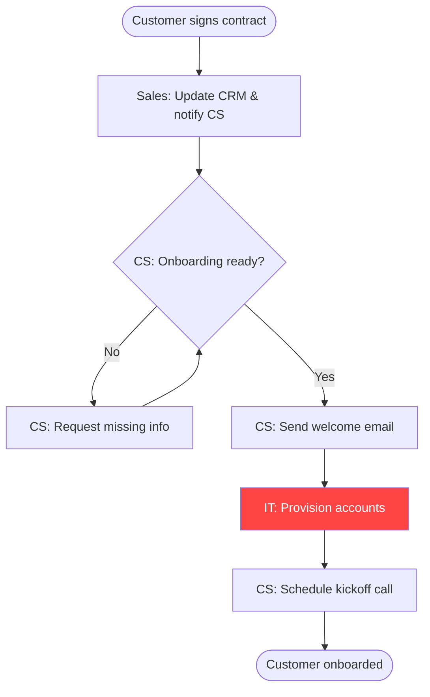

# Vaardigheid: Procesmapper

## Wanneer activeren
- Een bestaand proces documenteren dat alleen in iemands hoofd leeft
- Een nieuw proces in kaart brengen voordat je een SOP of trainingsmateriaal bouwt
- Identificeren waar overdrachten mislukken, stappen vertragen of werk verloren gaat
- Een RACI-matrix bouwen voor cross-functionele processen met onduidelijk eigenaarschap
- Voorbereiden op een procesaudit, ISO-certificering of operationele beoordeling
- Vóór het automatiseren van een workflow — breng het eerst handmatig in kaart, elimineer dan verspilling

## Wanneer NIET gebruiken
- Je hebt al een volledig gedocumenteerd en actueel proces — gebruik `/sop-writer` om het bij te werken
- Het proces betreft slechts één persoon zonder overdrachten — gebruik een eenvoudige checklist
- Je brengt een technische systeemarchitectuur in kaart — dat is een ander diagramtype
- Het proces bestaat nog niet en je moet het van nul ontwerpen — begin eerst met een workflow-ontwerpsessie

## Instructies

### Volledige proceskaarteringsprompt

```
Breng het volgende bedrijfsproces van begin tot eind in kaart.

Procesnaam: [bijv. Klant onboarding, Factuurgoedkeuring, Leveranciersinkoopproces]
Trigger: [Wat start dit proces? bijv. Nieuwe klant tekent contract]
Eindsituatie: [Hoe ziet "klaar" eruit? bijv. Klant heeft ingelogd en setup voltooid]
Deelnemers: [Lijst alle betrokken rollen — bijv. Verkoop, Customer Success, Finance, IT]
Betrokken tools/systemen: [CRM, ERP, e-mail, Slack, etc.]

Bekende knelpunten (indien aanwezig): [wat je al weet dat kapot of langzaam is]

Produceer:

## 1. Procesoverzicht
- Starttrigger
- Eindsituatie
- Geschatte totale duur (beste geval / slechtste geval)
- Aantal overdrachten
- Aangeraakte systemen

## 2. Stapsgewijze proceskaart
Voor elke stap:
- Stapnaam
- Wie het doet (rol, niet persoon)
- Invoer: wat ze ontvangen
- Uitvoer: wat ze produceren
- Gebruikte tool/systeem
- Geschatte tijd
- Veelvoorkomende faalmodus

Formaat als een genummerde tabel met kolommen: # | Stap | Eigenaar | Invoer | Uitvoer | Tool | Tijd | Faalmodus

## 3. RACI-matrix
Koppel elke stap aan: Verantwoordelijk / Aansprakelijk / Geconsulteerd / Geïnformeerd
Regels:
- Slechts ÉÉN persoon kan Aansprakelijk zijn per stap (als er meerdere zijn, is dat een probleem)
- Verantwoordelijk doet het werk. Aansprakelijk is eigenaar van de uitkomst. Verwar ze niet.
- Geconsulteerd = moet worden gevraagd vóór actie. Geïnformeerd = daarna verteld.

## 4. Knelpuntanalyse
Identificeer stappen waar:
- De cyclustijd onevenredig is aan de toegevoegde waarde
- Overdrachten het vaakst mislukken of vertraagd zijn
- Dezelfde herbewerking of fout herhaaldelijk voorkomt
- Eén persoon een knelpunt is (sleutelpersoon-afhankelijkheid)

Score elke stap: Groen (soepel) / Amber (vertragingen komen voor) / Rood (frequente fouten)

## 5. Verbeteraanbevelingen
Voor elke Rode/Amber stap:
- Hoofdoorzaak (waarom mislukt dit?)
- Snelle oplossing (< 1 week, geen nieuwe tools)
- Middelmatige oplossing (2-4 weken, kan nieuwe tooling vereisen)
- Proceseigenaar voor de oplossing
- Geschatte impact: [tijd bespaard / foutpercentagevermindering / kosten bespaard]

## 6. Automatiseringsmogelijkheden
Welke stappen zijn kandidaten voor automatisering?
Criteria: repetitief, regelgebaseerd, hoog volume, weinig oordeel vereist
Voor elke kandidaat: welke tool/systeem zou het afhandelen, en wat is de ROI-schatting?
```

### Snel processchets (10-minutenversie)

```
Geef me een snelle proceskaart voor: [PROCESNAAM]

Context:
- Wie triggert het: [rol]
- Wie rondt het af: [rol]
- Geschatte stappen: [N]
- Belangrijkste overdrachtpunten: [lijst ze]

Uitvoer:
1. Lineaire stappenlijst met eigenaar en tool voor elke stap
2. Top 2 knelpunten (waar het meestal breekt)
3. Eén verbeteraanbeveling
```

### RACI-matrixgenerator

```
Bouw een RACI-matrix voor het volgende proces.

Proces: [naam]
Stappen: [lijst elke stap, genummerd]
Betrokken rollen: [lijst alle rollen, bijv. Ops Manager, Finance, IT, Legal, CEO]

Te hanteren regels:
1. Precies één Aansprakelijke per stap — als je er twee zou plaatsen, markeer het als een eigenaarschapsprobleem
2. Als Geconsulteerd > 3 per stap, markeer het als beslissingsknelpunt
3. Als een rol als Aansprakelijke verschijnt op > 50% van de stappen, markeer sleutelpersoon-afhankelijkheid

Uitvoer:
- Volledige RACI-tabel (rijen = stappen, kolommen = rollen)
- Geïdentificeerde eigenaarschapsproblemen (gedeelde aansprakelijkheid / geen aansprakelijkheid)
- Knelpuntrollen (overbelast met Verantwoordelijk of Geconsulteerd)
- Aanbeveling: welke rol zou dit proces van begin tot eind moeten bezitten?
```

### Knelpunt diepgaand onderzoek

```
Ik heb een proces met een bekend knelpunt bij stap: [STAPNAAM]

Wat we weten:
- Gemiddelde tijd die deze stap duurt: [X uur/dagen]
- Verwachte tijd die het zou moeten duren: [X uur/dagen]
- Wie het beheert: [rol]
- Wat vertragingen veroorzaakt (vanuit observatie): [lijst bekende oorzaken]
- Downstream impact van vertraging: [wat er gebeurt als dit laat is]

Voer een 5 Waaroms-analyse uit op dit knelpunt:
Waarom 1: [waarom duurt het langer dan het zou moeten?]
Waarom 2: [waarom gebeurt dat?]
...tot de hoofdoorzaak

Produceer dan:
- Hoofdoorzaakverklaring (1 zin)
- 3 interventieopties (snel / middellang / structureel)
- Aanbeveling met redenering
- Succesmetriek: hoe weten we dat het is opgelost?
```

### Uitvoersjabloon proceskaart

```typescript
interface ProcessStep {
  id: number
  name: string
  owner: string           // role, not person
  input: string
  output: string
  tool: string
  estimatedMinutes: number
  failureMode: string
  bottleneckRating: 'green' | 'amber' | 'red'
}

interface RACIEntry {
  stepId: number
  stepName: string
  roles: Record<string, 'R' | 'A' | 'C' | 'I' | '-'>
}

interface ProcessMap {
  name: string
  trigger: string
  endState: string
  totalDurationMin: number
  totalDurationMax: number
  handoffCount: number
  steps: ProcessStep[]
  raci: RACIEntry[]
  bottlenecks: {
    stepId: number
    rootCause: string
    recommendation: string
    estimatedTimeSaved: string
  }[]
  automationCandidates: {
    stepId: number
    tool: string
    roi: string
  }[]
}
```

### Mermaid-stroomschema generator

```
Converteer de volgende processtappen naar een Mermaid-stroomschema.

Stappen:
1. [Stapnaam] — Eigenaar: [rol]
2. [Stapnaam] — Eigenaar: [rol]
...

Regels:
- Gebruik verschillende vormen per rol (rechthoek = één afdeling, diamant = beslissing/goedkeuring)
- Beslispunten (ja/nee, goedkeuren/afwijzen) moeten diamantvorm gebruiken
- Toon overdrachten als pijlen met labels
- Markeer knelpuntstappen in rood met een opmerking

Geef de volledige mermaid-diagramcodeblok.
```

Voorbeelduitvoer:


## Voorbeeld

**Gebruiker:** Breng ons leveranciersinkoopproces in kaart. Het begint wanneer een teamleider een nieuw hulpmiddel aanvraagt en eindigt wanneer de leverancier is gecontracteerd en toegang is ingericht. Betrokkenen: Teamleider, Ops Manager, Finance, Legal, IT.

**Uitvoer:**

```
## Procesoverzicht
Start: Teamleider dient toolverzoek in
Einde: Leverancier gecontracteerd, gebruikerstoegang ingericht
Duur: Beste geval 5 dagen / Slechtste geval 6 weken
Overdrachten: 7
Systemen: Aanvraagformulier (Google Form), e-mail, DocuSign, IT-ticketing

## Stapsgewijze kaart

| # | Stap | Eigenaar | Invoer | Uitvoer | Tool | Tijd | Faalmodus |
|---|---|---|---|---|---|---|---|
| 1 | Toolverzoek indienen | Teamleider | Zakelijke behoefte | Ingevuld formulier | Google Form | 30 min | Vage rechtvaardiging, geen ROI |
| 2 | Ops-beoordeling en triage | Ops Manager | Formulierindiening | Goedgekeurd/afgewezen beslissing | E-mail | 1-2 dagen | Geen SLA, verzoek blijft in inbox |
| 3 | Finance budgetcheck | Finance | Goedgekeurd verzoek | Budgetbevestiging | Spreadsheet | 1-3 dagen | ← ROOD: Geen duidelijke budgeteigenaar |
| 4 | Juridische leveranciersbeoordeling | Legal | Leverancier MSA | Geredigeerd contract | E-mail + DocuSign | 2-10 dagen | ← ROOD: Juridisch knelpunt |
| 5 | Contractuitvoering | Ops + Finance | Definitief contract | Ondertekende overeenkomst | DocuSign | 1 dag | Ondertekenaar niet beschikbaar |
| 6 | IT-inrichting | IT | Ondertekend contract | Toegang verleend | IT-tickets | 1-3 dagen | Ticket verloren of lage prioriteit |
| 7 | Bevestigen met aanvrager | Ops Manager | Toegang bevestigd | Gesloten lus | E-mail | 30 min | Wordt vaak overgeslagen |

## RACI-matrix
| Stap | Teamleider | Ops Mgr | Finance | Legal | IT |
|---|---|---|---|---|---|
| 1. Verzoek indienen | V/A | G | - | - | - |
| 2. Ops-beoordeling | G | V/A | G | - | - |
| 3. Budgetcheck | G | G | V/A | - | - |
| 4. Juridische beoordeling | - | G | G | V/A | - |
| 5. Contractuitvoering | - | A | V | G | - |
| 6. IT-inrichting | G | G | - | - | V/A |
| 7. Bevestigen | G | V/A | - | - | G |

## Knelpunten
ROOD — Stap 3 (Finance budgetcheck): Geen genoemde budgeteigenaar per afdeling. Alle verzoeken gaan naar dezelfde Finance-inbox.
ROOD — Stap 4 (Juridische beoordeling): Alle leverancierscontracten worden sequentieel beoordeeld. Geen sjabloon voor standaard SaaS-tools onder $10.000.

## Aanbevelingen
1. [SNEL] Veld voor afdelingsbudgeteigenaar toevoegen aan aanvraagformulier — Finance stuurt onmiddellijk door
2. [MIDDELLANG] Vooraf goedgekeurd leverancierssjabloon maken voor SaaS-tools < $10.000/jaar — volledige juridische beoordeling omzeilen
3. [STRUCTUREEL] Inkooptool implementeren (Zip, Ramp, Procurify) om alle verzoeken op één plek bij te houden
```

---

> **Werk met ons:** Claudient wordt ondersteund door [Uitbreiden](https://uitbreiden.com/) — we bouwen AI-producten en B2B-oplossingen met ontwikkelaarsgemeenschappen.
> [uitbreiden.com](https://uitbreiden.com/) · [Reddit](https://www.reddit.com/r/uitbreiden/) · [YouTube](https://www.youtube.com/@UITBREIDEN)
