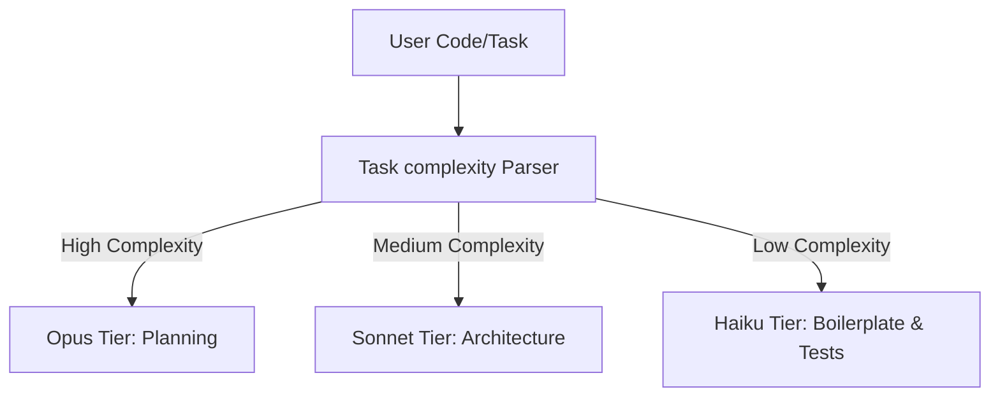
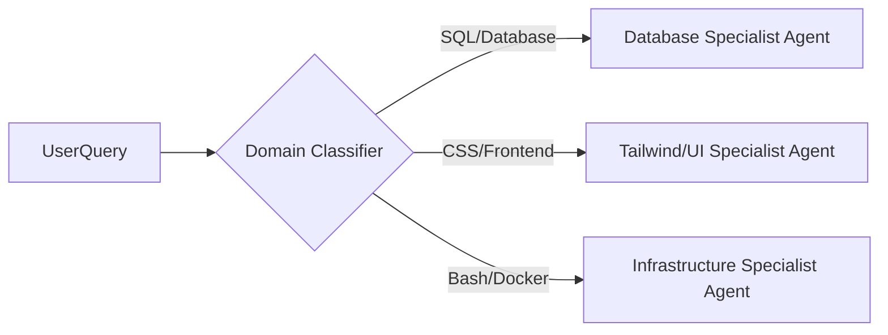
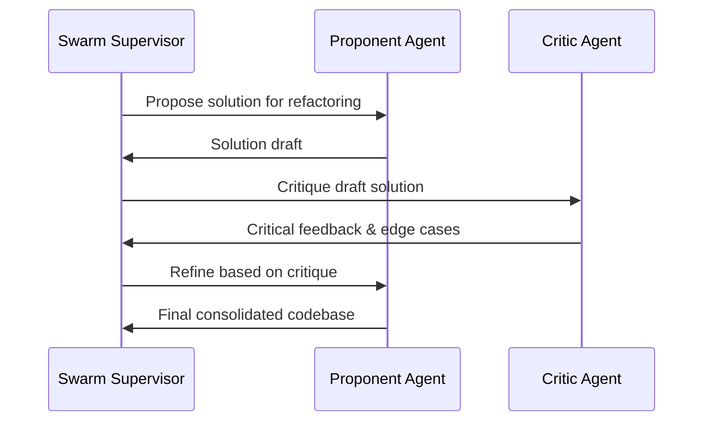

# Mixture of Experts (MoE) Architectures in Claudient

This document outlines architectures for routing requests across multiple models to optimize code generation, reasoning, and costs.

---

## 1. Architecture 1: Complexity-based Routing (Tiered Dispatch)

### How it Works
The system dynamically scales reasoning based on input heuristics (e.g. line additions, files impacted, security flags).

### Routing Rules
- **High Complexity**: Database migrations, security protocols, system configurations.
- **Medium Complexity**: Standard routing changes, API integrations, component composition.
- **Low Complexity**: Docstrings, CSS updates, standard test boilerplate.

---

## 2. Architecture 2: Domain-Expert Routing (Role-Based Dispatch)

### How it Works
Queries are parsed for keywords, languages, and technical directories to route to highly specialized templates/system instructions.

### Domain Mapping
- **Database Agent**: Configured with strict indexes, transaction safety, and query plan guidelines.
- **UI Agent**: Injected with accessibility requirements, layout systems, and performance indicators.
- **DevOps Agent**: Runs pre-flight checks, security sweeps, and infrastructure-as-code validations.

---

## 3. Architecture 3: Multi-Agent Consensus Swarm (Debate Routing)

### How it Works
For high-stakes decisions, a supervisor agent coordinates a debate between two adversarial expert agents, synthesizing the results before execution.

### Benefits
- Minimizes regressions on critical infrastructure paths.
- Prompts deep reasoning logs before write operations occur.
